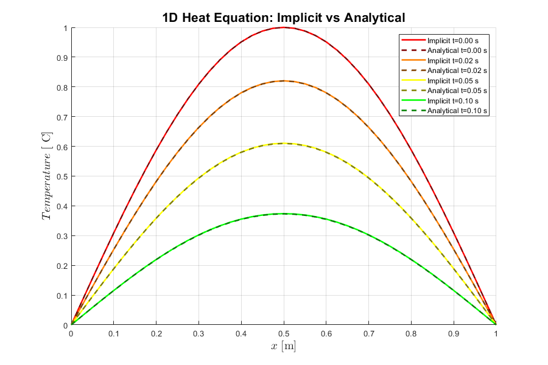

# BTCS Scheme – 1D Transient Heat Conduction

## Method
- Implicit Backward Time Central Space (BTCS) scheme
- Unconditionally stable
- Requires solution of linear system at each time step

---

## Numerical Implementation
- Tridiagonal system solved using TDMA
- Larger time steps possible compared to explicit scheme

---

## Observations
- Stable for all time step sizes
- Smoother temperature evolution
- Higher computational cost per time step

---

## Results
- Transient temperature profiles
- Comparison with analytical solution
- 

---

## Status
✅ Completed
