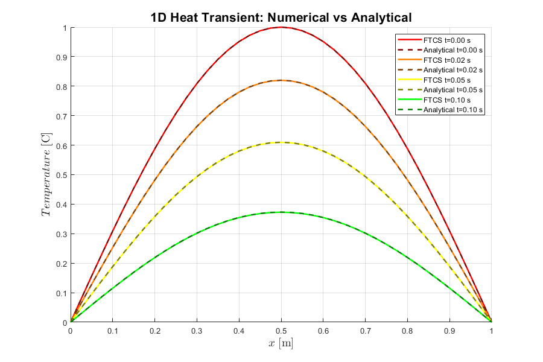

# FTCS Scheme – 1D Transient Heat Conduction

## Method
- Explicit Forward Time Central Space (FTCS) scheme
- Second-order accurate in space
- First-order accurate in time

---

## Stability Criterion
$$
Fo = \frac{\alpha \Delta t}{\Delta x^2} \le 0.5
$$

---

## Observations
- Stable solution obtained for Fo ≤ 0.5
- Numerical instability observed when Fo > 0.5
- Temperature evolves smoothly in time for stable cases

---

## Results
- Time evolution of temperature profiles
- Comparison with analytical solution
- 

---

## Status
✅ Completed

