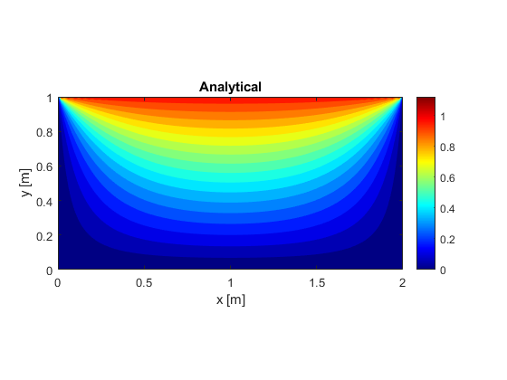
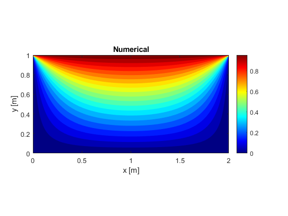
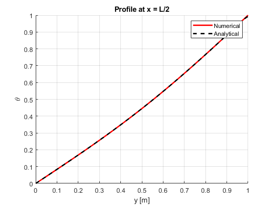
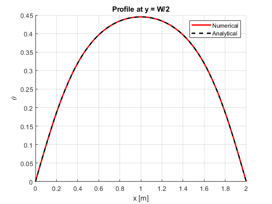

# 2D Steady-State Heat Conduction (FDM)

## Problem Description
Solve the 2D steady-state heat conduction equation in a rectangular domain
with prescribed boundary temperatures using the Finite Difference Method (FDM).

The temperature field is obtained numerically and compared with analytical
solution values at the midpoint lines of the domain.

---

## Governing Equation
$$
\frac{\partial^2 T}{\partial x^2}
+
\frac{\partial^2 T}{\partial y^2}
= 0
$$

(Laplace equation – no heat source)

---

## Numerical Method
- Uniform Cartesian grid
- 5-point finite difference stencil
- Gauss–Seidel iterative solver
- Convergence based on residual tolerance

---

## Boundary Conditions
Dirichlet (fixed temperature):
- Top wall: 150°C
- Bottom wall: 50°C
- Left wall: 50°C
- Right wall: 50°C

---

## Validation Approach
Analytical solution for a rectangular plate is used for comparison at:
- Mid-width : \( x = L/2 \)
- Mid-height: \( y = W/2 \)

Observations:
- Numerical results agree very well with analytical predictions
- Maximum error decreases with finer grids

---

## Results

### Temperature Contours

### Mid-Width Validation (x = L/2)

### Mid-Height Validation (y = W/2)

---

## Key Learnings
- Extension of FDM from 1D to 2D
- Effect of discretization density on accuracy
- Using Gauss–Seidel convergence effectively

---

## Tools Used
- MATLAB

---

## Status
✅ Completed and validated
