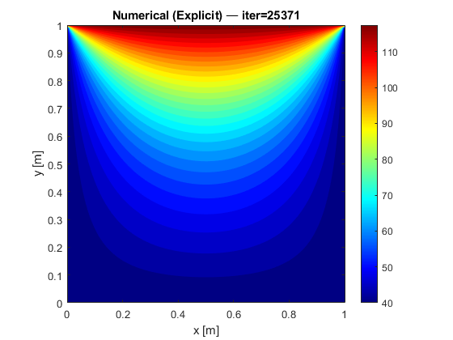
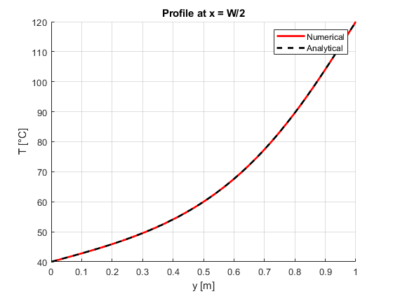
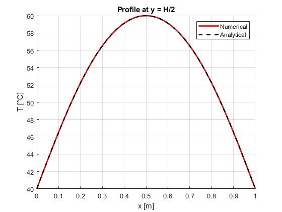

# 2D Transient Heat Conduction (FDM)

## Problem Description
This project solves the transient heat conduction equation in a 2D square domain
using the Finite Difference Method (FDM). The temperature evolves with time until
steady state is reached.

---

## Governing Equation
$$
\frac{\partial T}{\partial t}
= \alpha
\left(
\frac{\partial^2 T}{\partial x^2} +
\frac{\partial^2 T}{\partial y^2}
\right)
$$

---

## Numerical Method
- Finite Difference Method (FDM)
- Time stepping: FTCS (Explicit) 
- Spatial discretization: second-order central difference (5-point stencil)
- Uniform structured grid

---

## Boundary & Initial Conditions
- Square domain, size: 1 x 1
- Dirichlet boundary conditions on all edges
- TL = 40°C ( Temperature at left side of the plate )
- TR = 40°C ( Temperature at right side of the plate )
- TB = 40°C ( Temperature at bottom side of the plate )
- TT = 120°C ( Temperature at top side of the plate )

  
---

## Stability Condition (Explicit FTCS)

$Fo = \frac{\alpha \Delta t}{\Delta x^2} \le 0.25$

Simulation run with a stable time step and monitored until steady behavior observed.

---

## Validation
Temperature at steady state should satisfy Laplace equation:

$\nabla^2 T = 0$

Observed:
- Steady state numerical result matches analytical solution
- Line profiles extracted at:
  - \(x = L/2\)
  - \(y = H/2\)

---

## Results

### Temperature Evolution

### Validation at Mid-Width (x = L/2)

### Validation at Mid-Height (y = L/2)

---

## Key Learnings
- Time evolution smooths gradients from boundaries toward interior
- Influence of time step and Fourier number on stability
- 2D transient naturally approaches 2D steady solution

---

## Tools Used
- MATLAB

---

## Status
✅ Completed and validated
