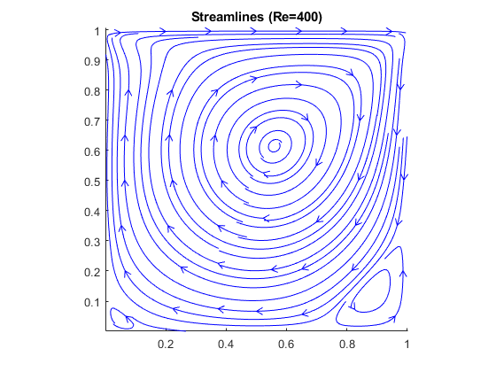
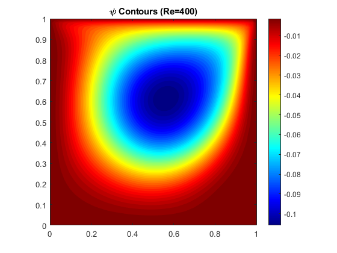
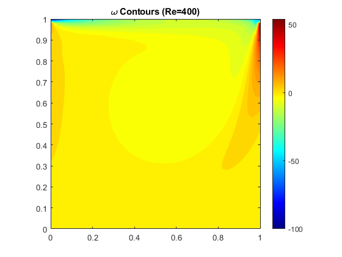
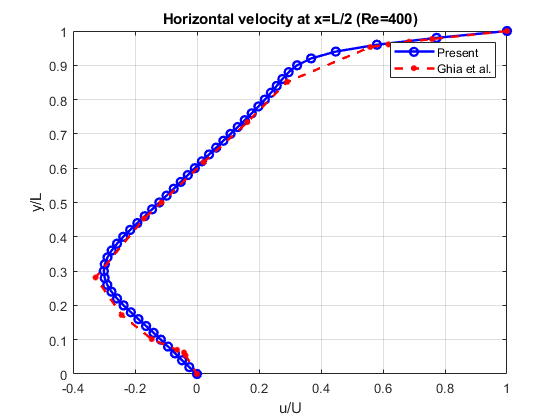
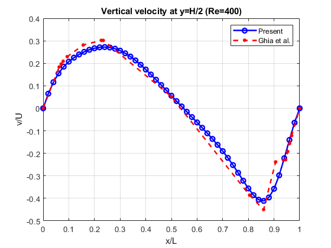

# Lid-Driven Cavity – Re = 400 (ψ–ω formulation)

## Flow Regime
- Steady laminar flow
- One dominant primary vortex
- Small corner vortices near bottom corners
- Stronger secondary vortices

---

## Results

### Streamlines

### Stream Contours

### Vorticity Contours

### Centerline Velocity Validation
- $(u\) vs \(y\) at \(x = 0.5\)$
- $(v\) vs \(x\) at \(y = 0.5\)$

---

## Observations
- Good match with Ghia et al. benchmark 
- Symmetric vortex center
- Smooth convergence to steady state

---

## Status
✔ Completed

