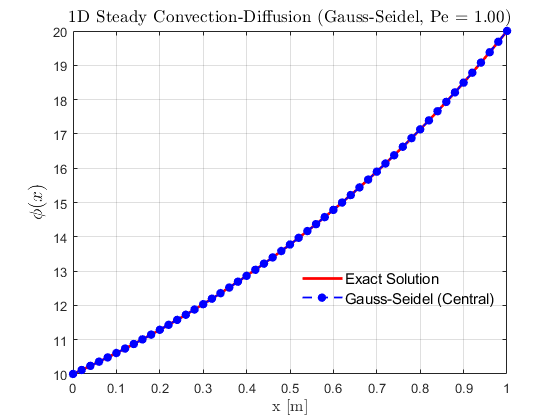

# 1D Steady Convection–Diffusion (FVM) — Central Differencing

## Objective
Solve the 1D steady convection–diffusion equation using the finite volume
method with central differencing for the convective term.

---

## Governing Equation

$$
u \frac{dT}{dx} = \alpha \frac{d^2T}{dx^2}
$$

Boundary conditions:
- $T(0) = T_L\$
- $T(L) = T_R\$

Analytical solution:

$T(x) = T_L + \frac{(T_R - T_L)\left(e^{Pe\,x/L}-1\right)}{e^{Pe}-1}$
where
$Pe = \frac{uL}{\alpha}$

---

## Numerical Method
- Cell-centered FVM
- Diffusion flux:
  
  $D = \frac{k}{\Delta x}$
  
- Convection flux:
  
  $F = \rho u$
  
- Central differencing for fluxes:
  
  $(uT)_e = u_e \frac{T_P + T_E}{2}$

- Linear system assembled and solved in MATLAB

---

## Stability Note
Central differencing becomes **unstable/unbounded** when:

$Pe > 2$

Oscillations may occur.

---

## Results

### Analytical vs Numerical

---

## Observations
- Good match for low convection (Pe small)
- High Peclet → oscillations
- Shows need for upwinding

---

## Tools Used
- MATLAB

---

## Status
✔ Completed  
✔ Validated for low Peclet
