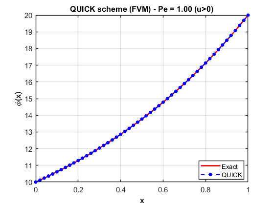
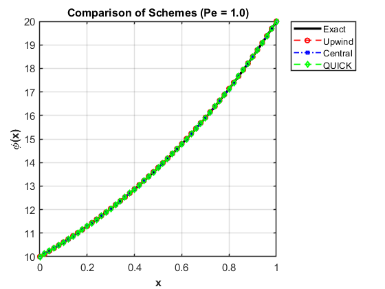

# 1D Steady Convection–Diffusion (FVM) — QUICK Scheme

## Objective
Solve the 1D steady convection–diffusion equation using the FVM with the
QUICK (Quadratic Upstream Interpolation for Convective Kinetics) scheme
for convective fluxes.

---

## Governing Equation
$$
u \frac{dT}{dx} = \alpha \frac{d^2T}{dx^2}
$$

Boundary conditions:

$T(0) = T_L,\qquad T(L) = T_R$

Analytical solution:

$T(x) = T_L + \frac{(T_R - T_L)\left(e^{Pe\,x/L}-1\right)}{e^{Pe}-1}$

where

$Pe = \frac{uL}{\alpha}$

---

## Numerical Method

- Cell-centered finite volume method
- Diffusion: central differencing
- Convection: **QUICK**
  - Uses quadratic interpolation along flow direction
  - For positive velocity:
    
    $T_e = \frac{3T_P + 6T_{E} - T_{EE}}{8}$
    
  - Introduces a higher-order upstream bias
- Boundedness enforced near boundaries (hybrid treatment)
- Linear system solved using MATLAB backslash operator

---

## Why QUICK?
- **Higher accuracy** than upwind
- **Less numerical diffusion**
- Captures steeper gradients better
- Behaves well when:
  
  $Pe \le 10$
 

Trade-off:
- Can oscillate slightly near boundaries
- Requires special handling at inlet/outlet

---

## Results

### Temperature Profile (QUICK)

### Comparison of Schemes

---

## Observations
- QUICK lies between central and upwind:
  - **Central**: accurate but unstable at high Pe
  - **Upwind**: diffusive but stable always
  - **QUICK**: accurate and stable for moderate Pe
- Reduced artificial diffusion compared to upwind
- Steady monotonic solution for flows of engineering relevance

---

## Tools Used
- MATLAB

---

## Status
✔ Completed  
✔ Higher-order scheme implemented successfully  
✔ Reduced numerical dissipation compared to upwind

