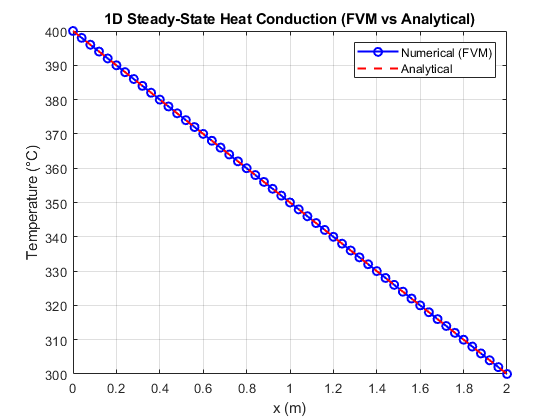

# 1D Steady-State Heat Conduction (FVM) — No Source

## Objective
Solve the steady-state heat conduction equation in a 1D rod using the
Finite Volume Method (FVM) with no internal heat generation.

---

## Governing Equation
$$
\frac{d^2T}{dx^2} = 0
$$

---
Boundary conditions:

$T_L = 400°C, \quad T_R = 300°C$

---

Analytical solution:

$T(x) = T_L + \frac{T_R - T_L}{L}x$

---

## Numerical Method
- Cell-centered FVM
- Uniform grid spacing
- Constant thermal conductivity $(k)$
- Linear system assembly:
  
  $a_W T_{i-1} + a_P T_i + a_E T_{i+1} = b_i$
  
- Note: Since the governing equation is linear and has no source term, it can also
  be solved analytically or using a simple finite difference discretization.

---

## Validation
Results match the analytical linear temperature distribution.

---

## Results

### Temperature at Cell Centers

---

## Tools Used
- MATLAB

---

## Status
✔ Completed and validated
