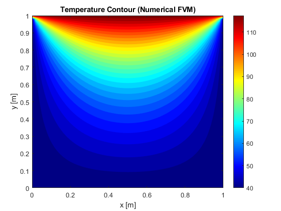
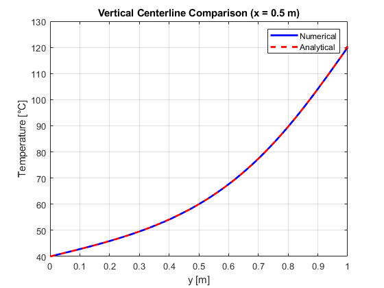
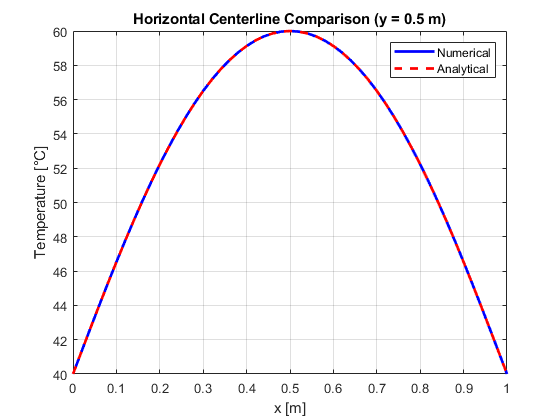

# 2D Steady-State Heat Conduction (FVM) — No Internal Source

## Objective
Solve the 2D steady-state heat conduction problem in a square/rectangular
domain using the cell-centered Finite Volume Method (FVM), with fixed
temperatures on all boundaries.

---

## Governing Equation
$$
\nabla^2 T = 
\frac{\partial^2 T}{\partial x^2} +
\frac{\partial^2 T}{\partial y^2} = 0
$$

(Laplace equation)

Boundary conditions:
- Dirichlet on all walls:
   \[
   $T = T_{wall}$
   \]

- Analytical solution available for validation at centerlines.

---

## Numerical Method
- Cell-centered finite volume formulation
- Control volume discretization:
  
  $a_W T_{i-1,j} + a_E T_{i+1,j} + a_S T_{i,j-1} + a_N T_{i,j+1} - a_P T_{i,j} = 0$
  
- Coefficients:
  
  $a_W = a_E = \frac{k}{\Delta x}, \quad$
  $a_S = a_N = \frac{k}{\Delta y}$
  
- Constant thermal conductivity
- Iterative Gauss–Seidel solver
- Residual-based convergence

---

## Validation
Centerline slices extracted and compared to analytical solution:
- $(x = L/2\)$
- $(y = W/2\)$

Good agreement observed, improving as grid is refined.

---

## Results

### Temperature Contour

### Mid-Width Validation $\(x=L/2\)$

### Mid-Height Validation $\(y=W/2\)$

---

## Observations
- Heat diffuses smoothly from high to low temperature walls
- Symmetry visible for symmetric BCs
- Finer mesh yields faster convergence and better accuracy

---

## Tools Used
- MATLAB

---

## Status
✔ Completed and validated

