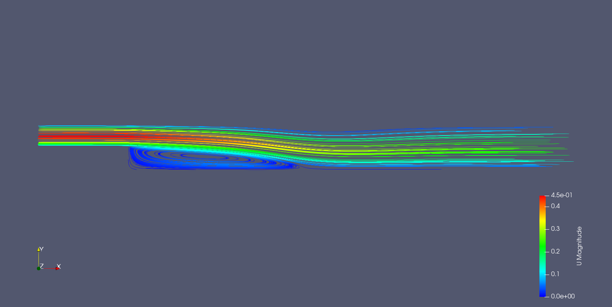
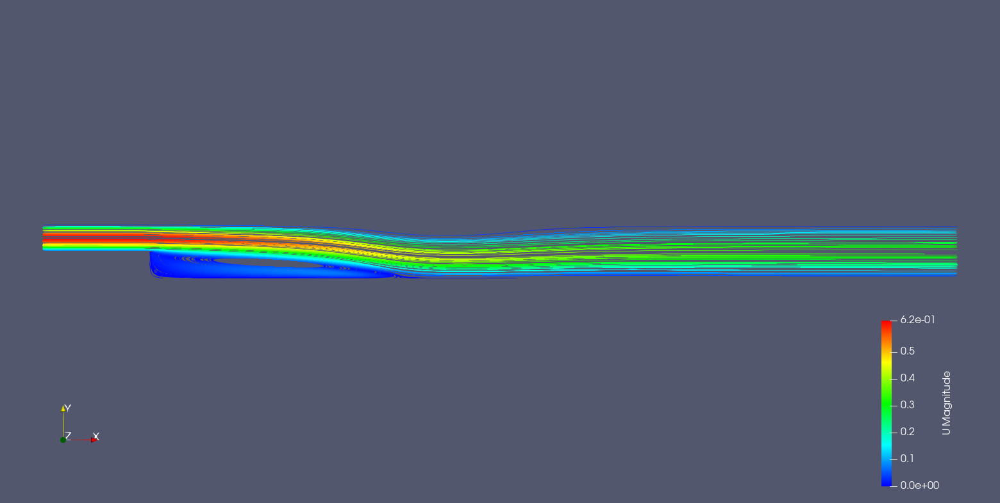
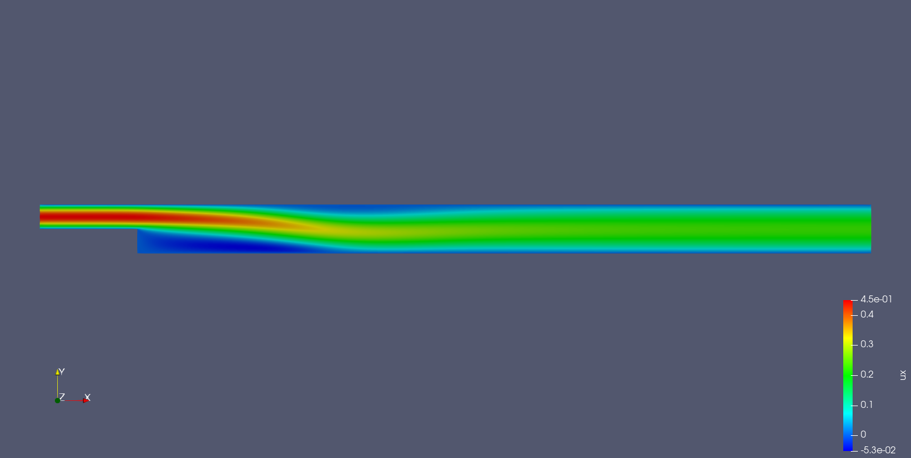
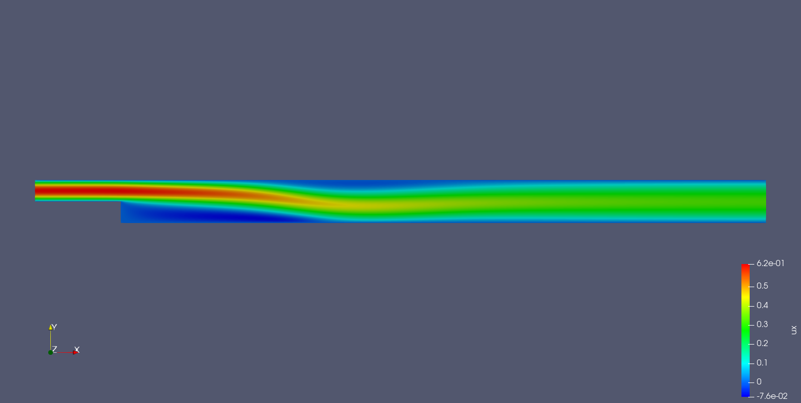
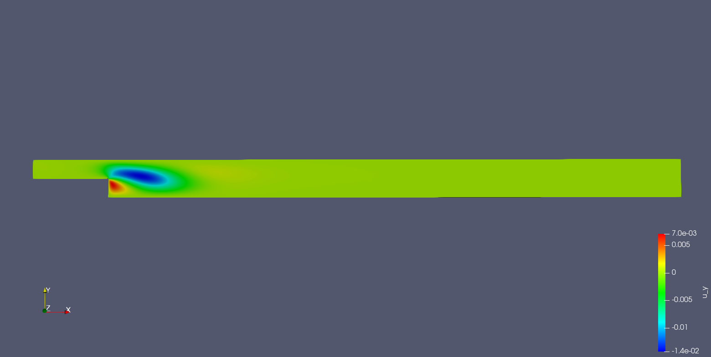
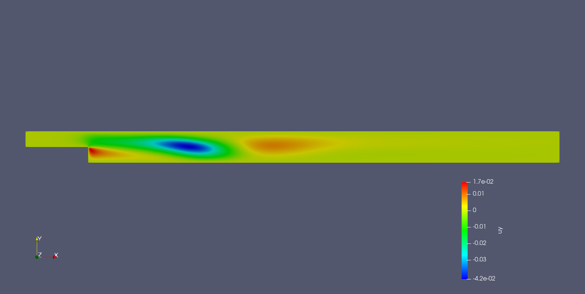
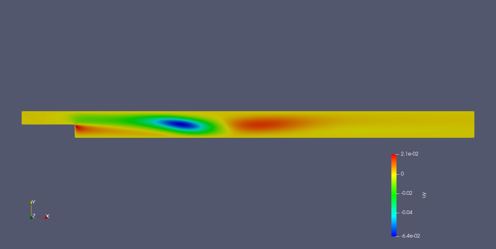
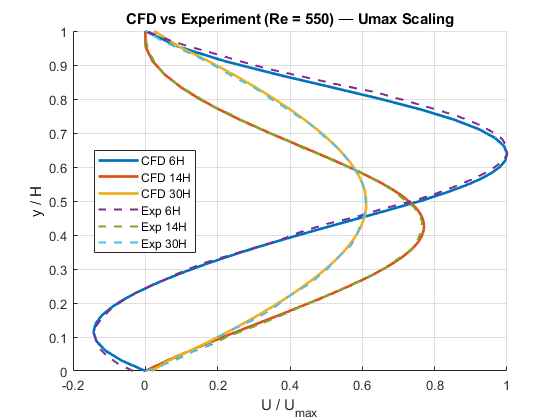
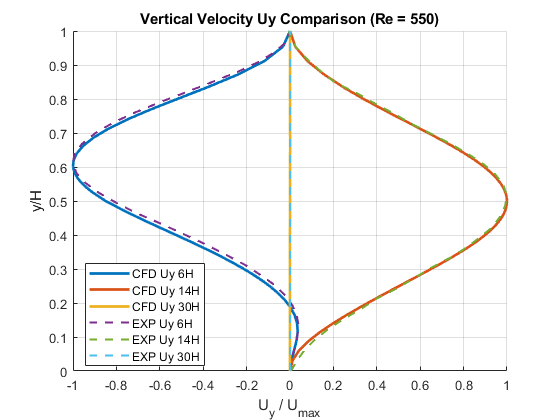
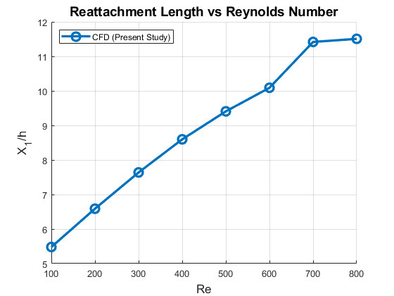

# Backward-Facing Step — OpenFOAM (Re = 100–800)

## Objective
Simulate flow over a backward-facing step at multiple Reynolds numbers and
validate the velocity field for Re = 550 using Rouizi et al. (2009).

---

## Case Overview
- 2D geometry
- Step height: $( H = 1 \)$
- Inlet length: $( 4H \)$
- Outlet length: $( 30H \)$
- Solvers: `simpleFoam and pimpleFoam`

---

## Reynolds Numbers Simulated

$Re = 100,\ 200,\ 300,\ 400,\ 500,\ 550,\ 600,\ 700,\ 800$

`Note:` In this report only results for $Re = 100,\ 400,\ 550\$ is shown 

---

## Governing Equations
$\nabla \cdot \mathbf{u} = 0$  
$\partial_t \mathbf{u} + (\mathbf{u}\cdot\nabla)\mathbf{u} = -\nabla p + \nu\nabla^2\mathbf{u}$

---

## Results Overview

### Streamlines (Flow Patterns)
| Re | Plot |
|----|------|
| 100 |  |
| 400 |  |
| 550 |  |

### Velocity $U_x$ Contours 
| Re | Plot |
|----|------|
| 100 |  |
| 400 |  |
| 550 |  |

### Velocity $U_y$ Contours 
| Re | Plot |
|----|------|
| 100 |  |
| 400 |  |
| 550 |  |
---

## Validation (only Re = 550)

### Reference
Rouizi et al., *Numerical model reduction of 2D steady incompressible laminar
flows: Application on the flow over a backward-facing step*, 2009.

### Comparison Plots
#### $( U / U_{max} \)  vs  \( y/H \)$

#### $( U_y / U_{max} \)  vs  \( y/H \)$

#### $Reattachment length\ vs\ Reynolds number$

---

## Key Observations
- Re = 100: short recirculation region
- Re = 400: stronger separation and growth of bubble
- **Re = 550: matches paper velocity profiles**

---

## Takeaway
This study demonstrates:
- Ability to configure OpenFOAM cases
- Understand recirculation and separation physics
- Validate against peer-reviewed literature
- Analyze flow evolution across Reynolds numbers

✔ Laminar flow 
✔ Strong validation at Re = 550  

