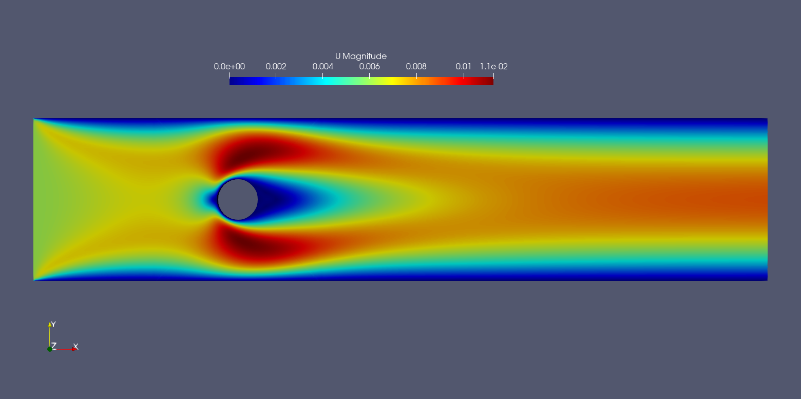
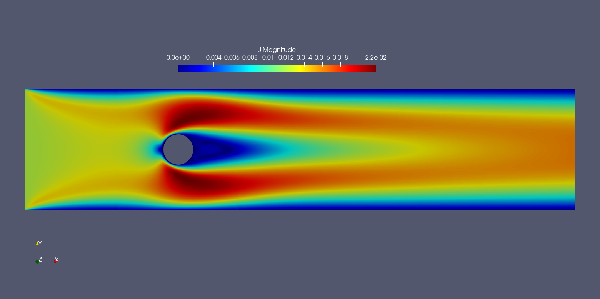
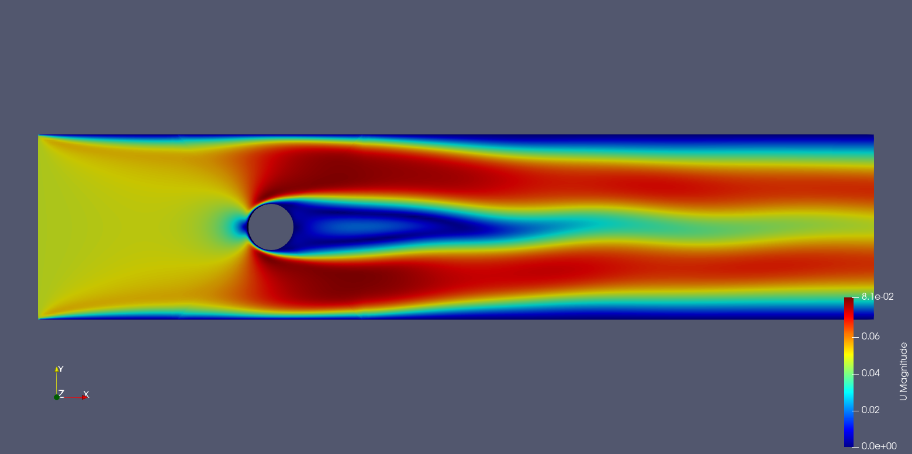
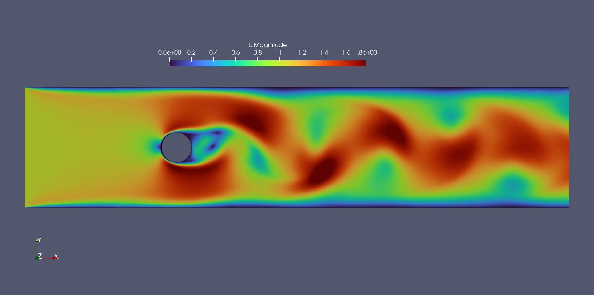

# Flow Over a Circular Cylinder (OpenFOAM)

## Objective
To simulate incompressible flow past a circular cylinder at different Reynolds
numbers and visualize wake development, separation, and vortex shedding.

---

## Reynolds Numbers Studied
Re = 20, 40, 150, 180

---

## Case Description
- 2D circular cylinder
- Uniform inlet velocity
- Laminar incompressible flow
- Solver: `icoFoam`
- Structured / body-fitted mesh

---

## Governing Equations
$\nabla \cdot \mathbf{u} = 0$  
$\partial_t \mathbf{u} + (\mathbf{u}\cdot\nabla)\mathbf{u}
= -\nabla p + \nu\nabla^2\mathbf{u}$

---

## Results

### Flow Regimes Observed
- **Re = 20**: Steady symmetric wake
- **Re = 40**: Onset of steady separation
- **Re = 150**: Periodic vortex shedding
- **Re = 180**: Stronger unsteady wake dynamics

---

### Velocity / Pressure Contours
| Re | Visualization |
|----|---------------|
| 20 |  |
| 40 |  |
| 150 |  |
| 180 |  |

---

### Vortex Shedding Animation (Representative Case)
Re = 150  

---

## Observations
- Transition from steady to unsteady wake captured
- Periodic vortex shedding observed beyond Re ≈ 100
- Wake width and unsteadiness increase with Reynolds number
- Solver captures qualitative physics of bluff-body flow

---

## Notes
This study focuses on **qualitative flow physics and visualization**.
No quantitative validation is claimed in this work.

---

## Status
✔ Geometry and mesh created  
✔ Multiple Reynolds number simulations  
✔ Contours and animations generated

