# RANS Simulation of Flow over Building Clusters (OpenFOAM)

## Objective
To simulate turbulent flow over clusters of buildings using Reynolds-Averaged
Navier–Stokes (RANS) turbulence models and investigate wake development,
recirculation, and flow interaction across a range of building configurations
and array sizes. Results for a 3×3 array configuration are validated against
published wind-tunnel data.

---

## Case Description
- Solver: `simpleFoam` (steady-state, incompressible RANS)
- Turbulence models: k-ε and k-ω SST
- Configurations studied:
  - Single building
  - Building rows of varying depth (3, 4, and 5 buildings in-line)
  - Building arrays (including 3×3, 4x4 and 5×5 configurations)
- Domain: rectangular channel with building models mounted on the floor,
  matching the general layout of wind-tunnel building-cluster studies

---

## Governing Equations

Reynolds-Averaged continuity and momentum equations:

$$
\nabla \cdot \mathbf{u} = 0
$$

$$
\nabla \cdot (\mathbf{u}\mathbf{u}) = -\nabla p + \nabla \cdot \left[(\nu + \nu_t)\nabla \mathbf{u}\right]
$$

closed using either the standard k-ε or k-ω SST turbulence model.

---

## Grid Independence Study (3×3 Configuration)

Two mesh resolutions (`grid1`, `grid2`) were compared at six streamwise
stations behind the 3×3 array, plotting non-dimensional streamwise velocity
(U/U_δ) against normalized height (Z/H_B).

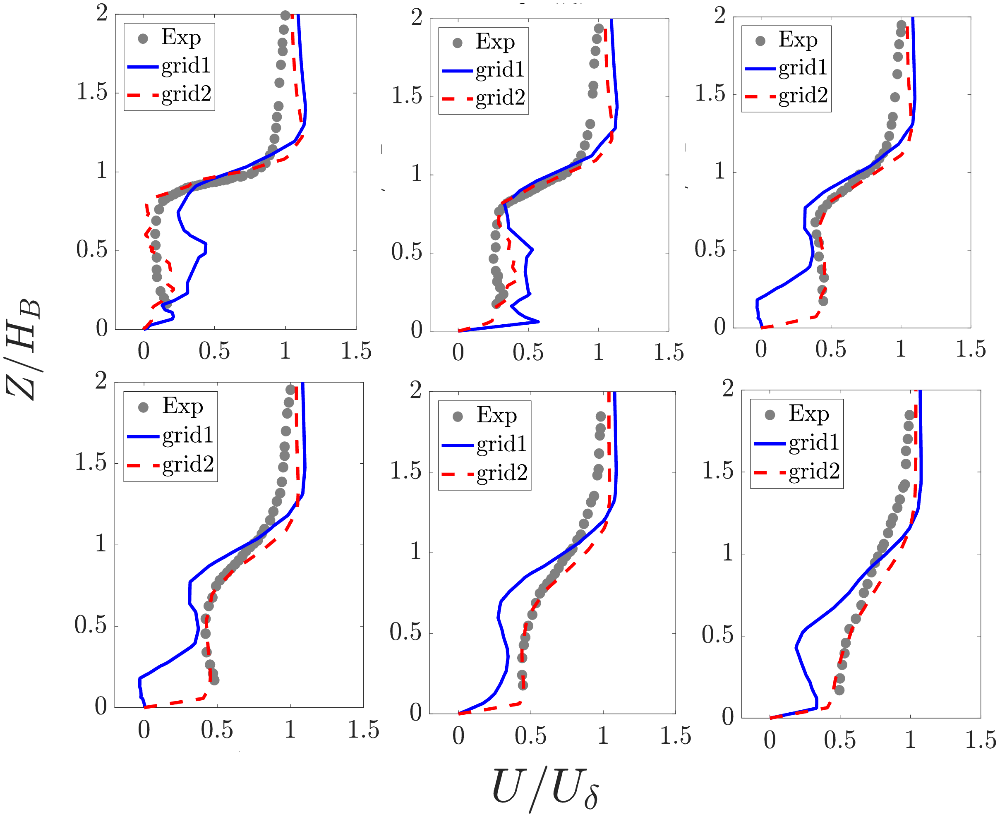

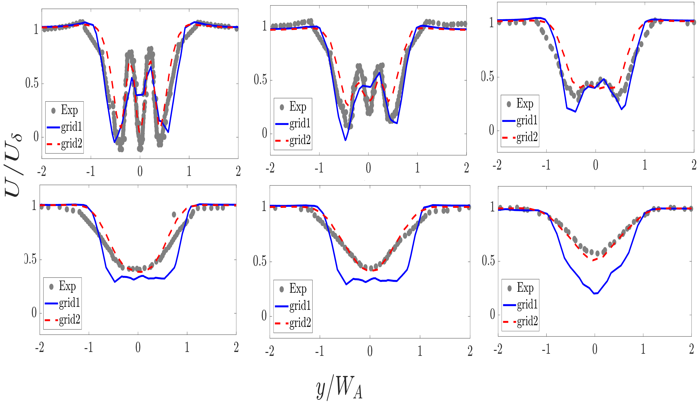

`grid2` shows closer agreement with experimental data and removes a
non-physical velocity spike present in `grid1` within the canopy region
(Z/H_B < 0.6), confirming mesh-independent behavior at the finer resolution.

---

## Validation (3×3 Configuration)

Velocity profiles at six streamwise stations behind the 3×3 array were
compared against the wind-tunnel dataset of **Mishra et al. (2023)**.

**Reference:**
Mishra, A., Placidi, M., Carpentieri, M., Robins, A. (2023).
*Wake Characterization of Building Clusters Immersed in Deep Boundary Layers.*
Boundary-Layer Meteorology, 189, 163–187.
https://doi.org/10.1007/s10546-023-00830-0

### Observations
- Good agreement with experimental data above building height (Z/H_B > ~1)
  across all six stations.
- Deviation observed in the near-canopy region (Z/H_B < ~0.6), including a
  non-physical velocity spike on the coarser grid.
- The inlet condition used in this study was a simplified (near-uniform)
  velocity profile rather than a fully-developed atmospheric boundary layer
  (ABL) profile matching the reference wind-tunnel setup. This is identified
  as a likely contributor to the near-canopy discrepancy and is a target for
  refinement in future work.

---

## Additional Configurations (Qualitative)

Velocity contours were also generated for building rows of increasing depth
(3, 4, and 5 buildings) and for a 5×5 array configuration, to qualitatively
examine wake development, jet formation between buildings, and merging of
individual wakes into a global wake structure with increasing array size.
These configurations were not formally validated against benchmark data.

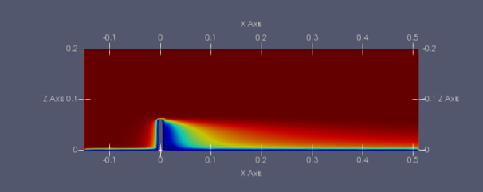

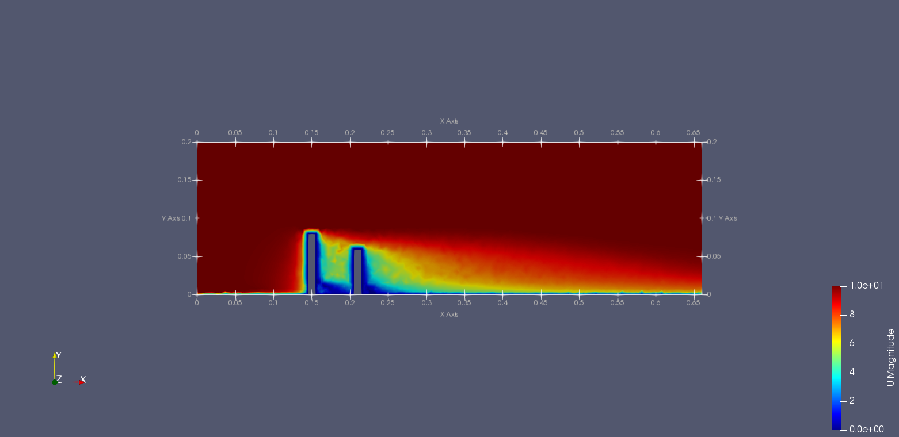

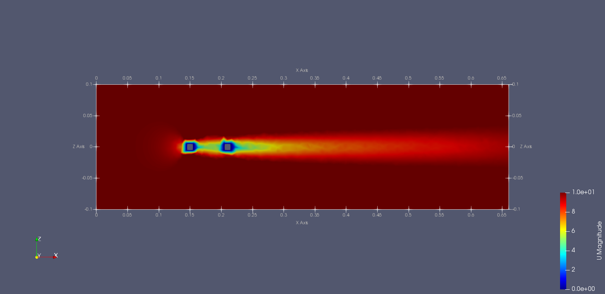

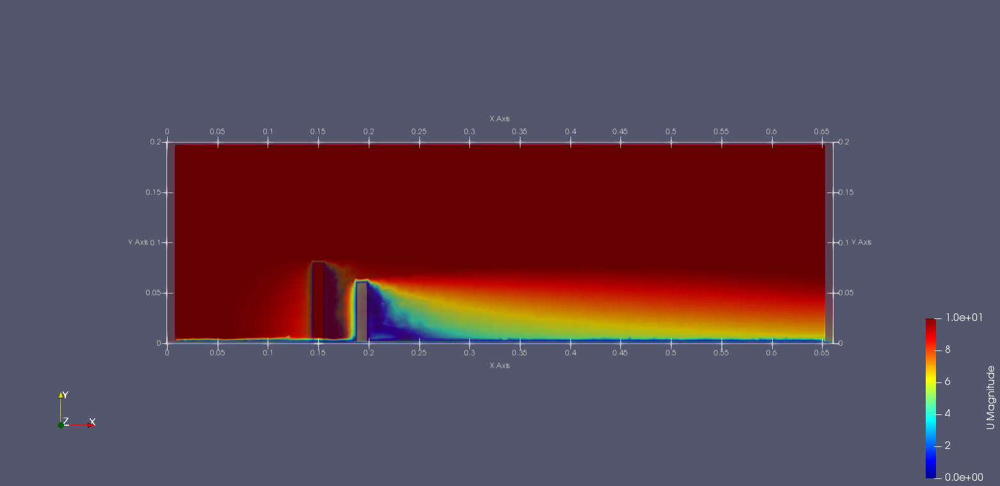

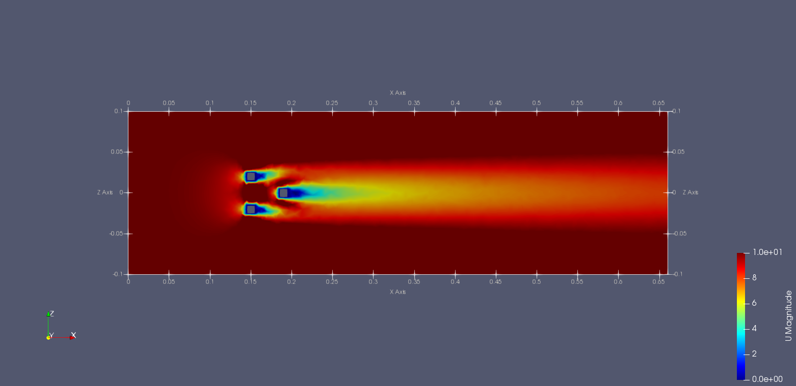

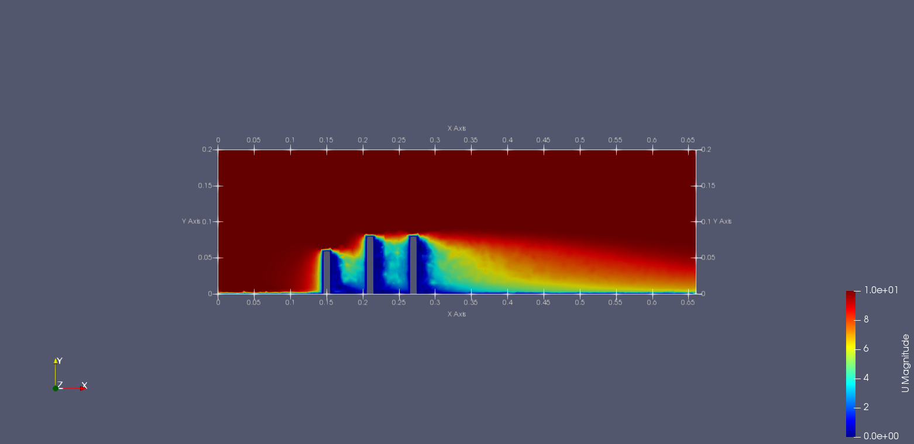

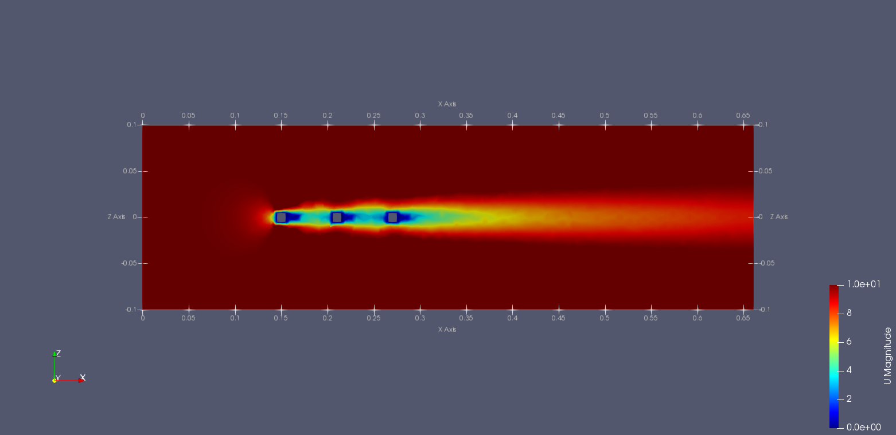

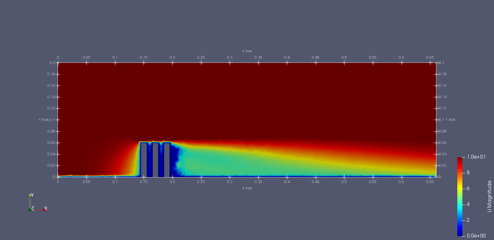

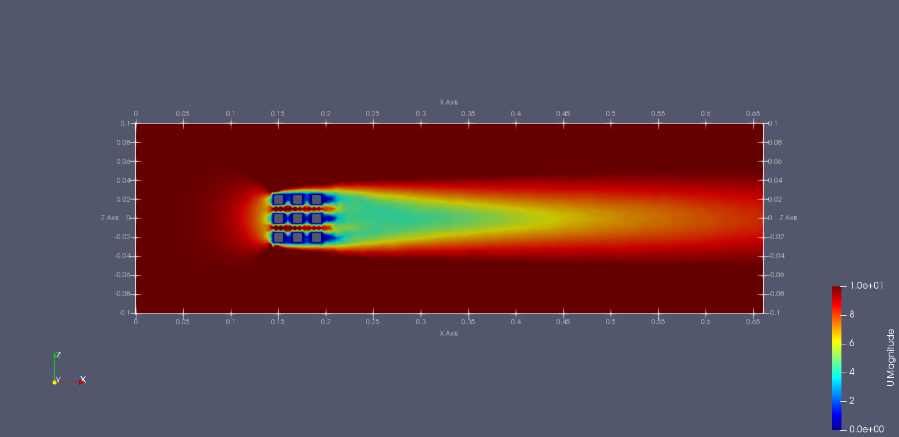

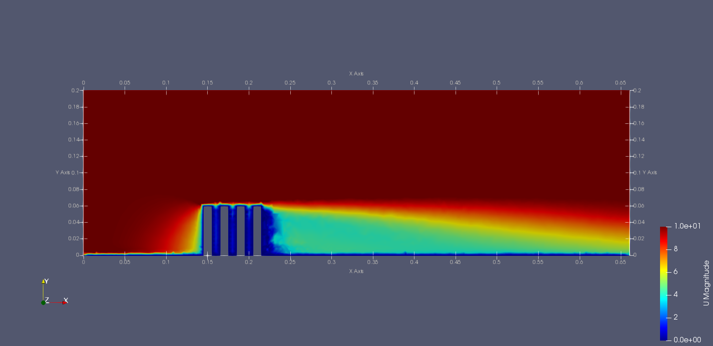

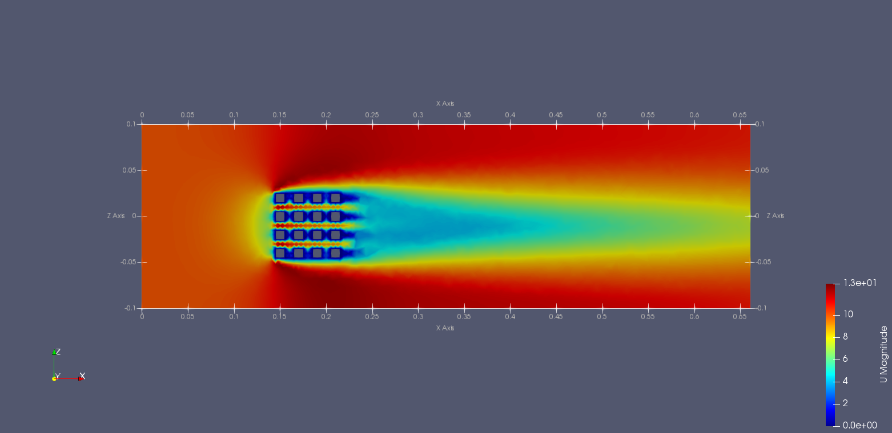

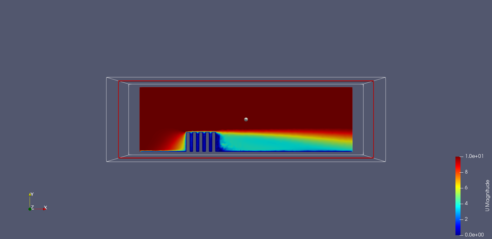

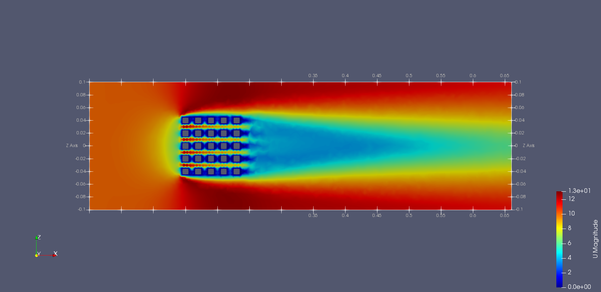

---

## Key Observations
- Wake recirculation and channelling effects between buildings are captured
  consistently across configurations.
- Individual building wakes merge into a combined wake with increasing
  streamwise distance, consistent with the physical picture reported in the
  reference study.
- RANS (k-ε / k-ω SST) captures the qualitative wake structure well above
  building height; near-canopy accuracy is sensitive to inlet boundary
  conditions and mesh resolution.

---

## Tools Used
- OpenFOAM (`simpleFoam`)
- ParaView (post-processing and visualization)

---

## Status
✔ Single building, row (3/4/5), and array (3×3, 4x4 5×5) configurations simulated
✔ Grid-independence study completed for 3×3 configuration
✔ Validated against Mishra et al. (2023) at six streamwise stations (3×3 only)
◻ ABL-consistent inlet profile — planned refinement
◻ Formal validation for 5×5 and row configurations — not yet completed
