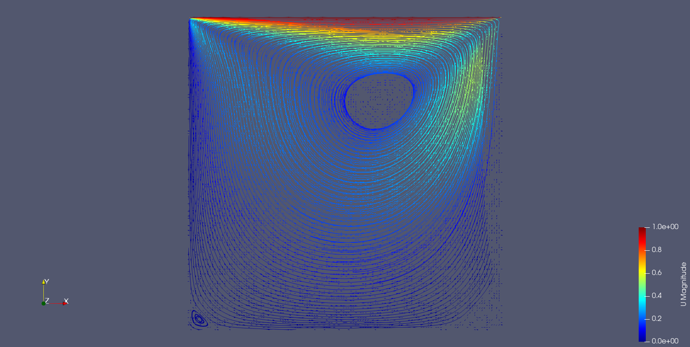
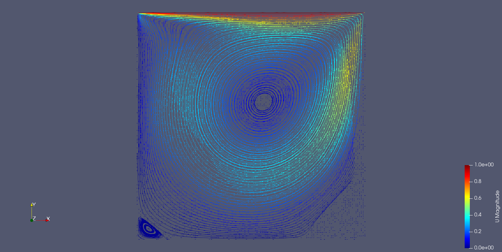
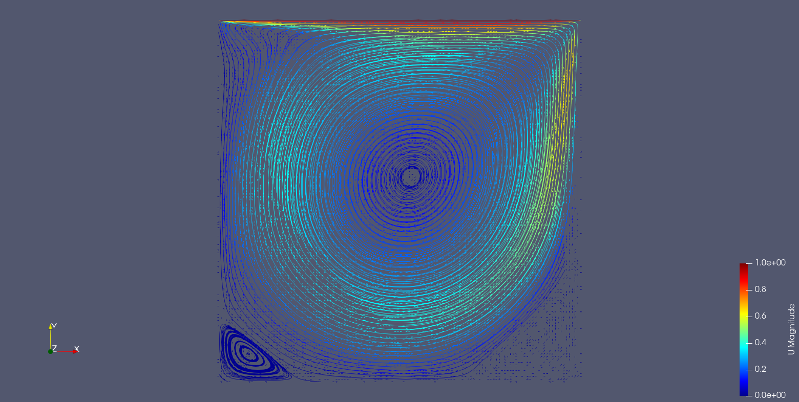
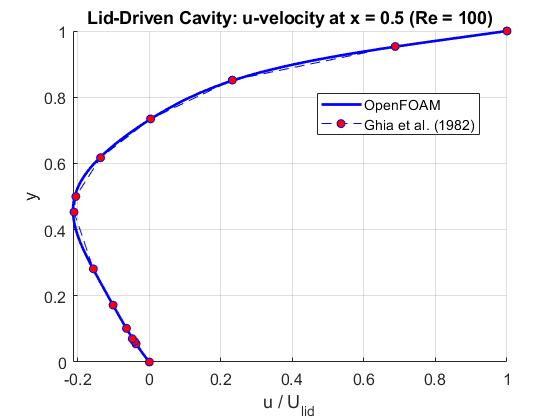
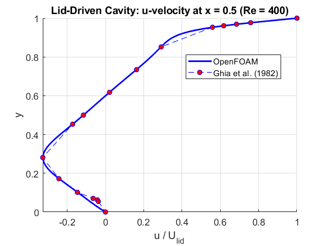
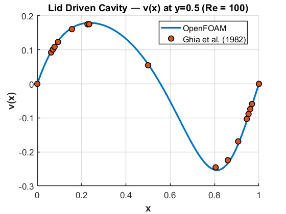
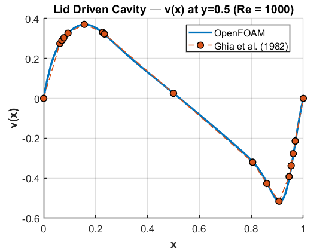

# Lid-Driven Cavity Flow (OpenFOAM)  
Re = 100, 400, 1000

## Objective
Simulate 2D lid-driven cavity flow using OpenFOAM and validate velocity
profiles against Ghia et al. (1982) for multiple Reynolds numbers.

---

## Problem Description
- 2D square cavity (1×1)
- Sliding lid with constant horizontal velocity
- Remaining walls no-slip
- Laminar incompressible Navier–Stokes
- Solver: `icoFoam`

---

## Governing Equations

$\nabla \cdot \mathbf{u} = 0,\quad \partial \mathbf{u}/\partial t + (\mathbf{u}\cdot\nabla)\mathbf{u} = -\nabla p + \nu \nabla^2 \mathbf{u}$ 

---

## Reynolds Numbers Investigated
| Re | Viscosity |
|----|-----------|
| 100 | 0.01 |
| 400 | 0.0025 |
| 1000| 0.001 |

---

## Boundary Conditions
| Patch       | u | p |
|-------------|------------|---------------|
| Lid (moving)| (1 0 0) fixedValue | zeroGradient |
| Other walls | (0 0 0) fixedValue | zeroGradient |

Mesh: uniform structured (e.g., 50×50 or higher)

---

## Validation
Velocity extracted along:
- Vertical centerline $\(x = 0.5\): compare \(u(y)\)$
- Horizontal centerline $\(y = 0.5\): compare \(v(x)\)$

Reference:
**Ghia, U., Ghia, K., Shin, C. (1982). J. Comp. Phys.**

---

## Results

### Streamlines
| Re | Contour |
|----|----------|
| 100 |  |
| 400 |  |
| 1000 |  |

### Velocity Magnitude

### Centerline Validation
| Re | u(y) centerline |
|----|------------------|
| 100 |  |
| 400 |  |
| 1000 |  |

| Re | v(x) centerline |
|----|------------------|
| 100 |  |
| 400 |  |
| 1000 |  |

---

## Observations
- Re=100: single main vortex
- Re=400: secondary corner vortices appear
- Re=1000: stronger circulation and sharper shear near top
- Numerical results compare well with Ghia profiles

---

## Tools Used
- OpenFOAM
- ParaView
- MATLAB for extracting centerline profiles

---

## Status
✔ Mesh setup  
✔ Three Reynolds cases solved  
✔ Streamlines and centerline validation plotted  
