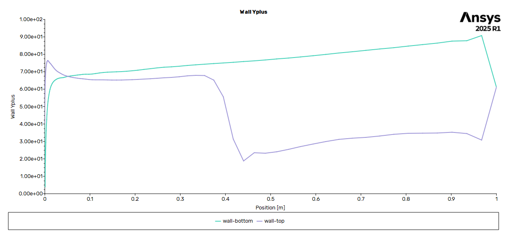
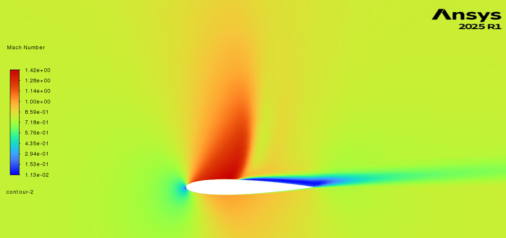
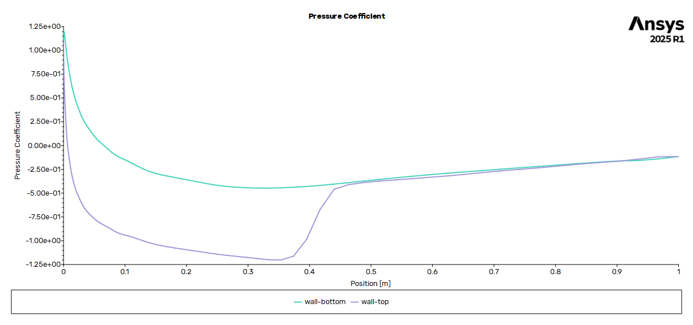
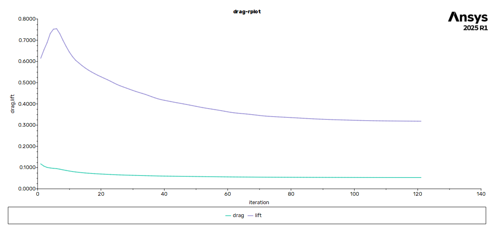

# Aerodynamic Analysis of NACA 0012 Airfoil (ANSYS Fluent)

## Objective
To perform external aerodynamic analysis of a NACA 0012 airfoil using
ANSYS Fluent and evaluate lift, drag, pressure distribution, and near-wall
flow behavior.

## Simulation Details
- Solver: ANSYS Fluent (pressure-based)
- Turbulence model: k–ω SST
- Flow regime: Incompressible, turbulent
- Angles of attack studied:  4°
- Mesh: Structured mesh with boundary-layer refinement

## Mesh and Near-Wall Treatment
Boundary-layer refinement was applied near the airfoil surface, and the
near-wall resolution was verified using y⁺ distribution.

## Results

### Velocity Contours

### Pressure Contours

### Pressure Coefficient Distribution

### Aerodynamic Coefficients

The results show an expected increase in lift with angle of attack and
pressure distributions consistent with classical airfoil aerodynamics.

## Notes
This study focuses on demonstrating external aerodynamic CFD workflow
and interpretation of aerodynamic performance metrics using ANSYS Fluent.

