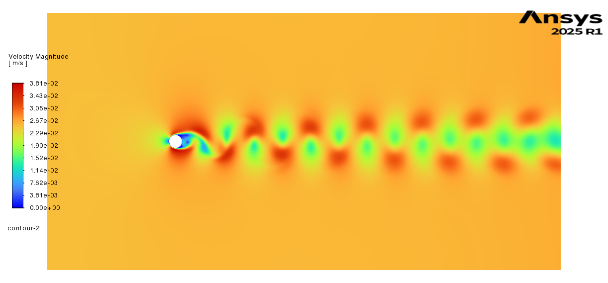
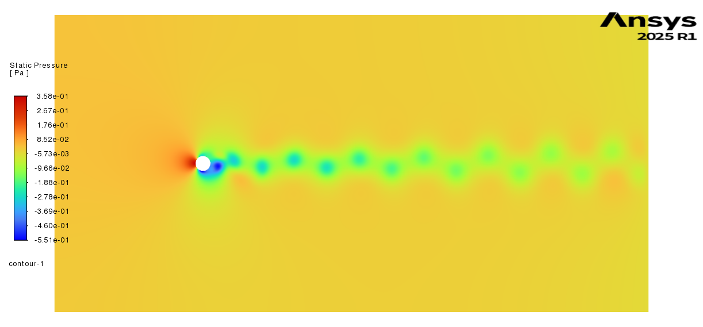
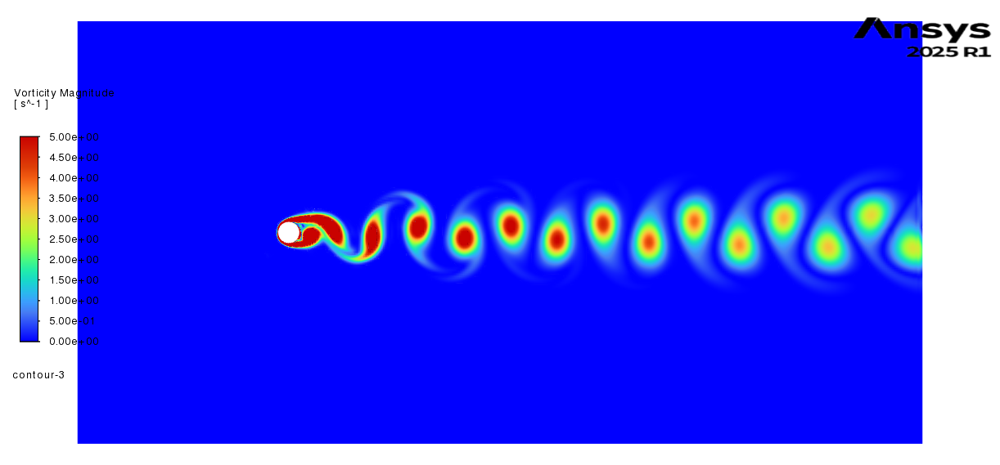
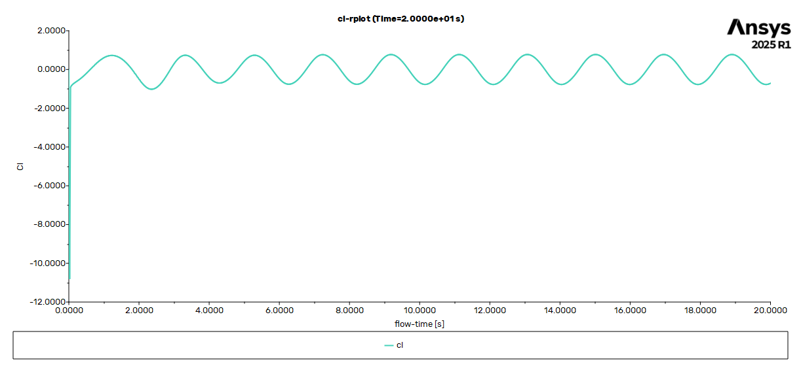
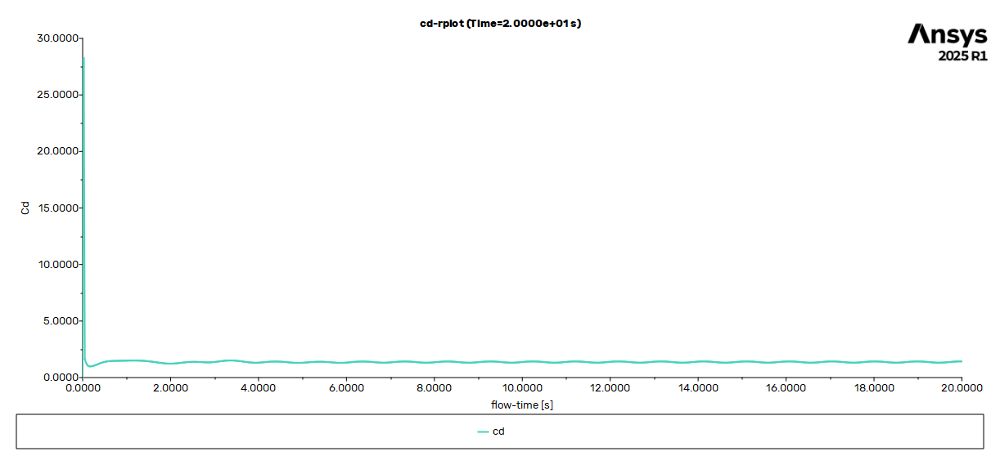
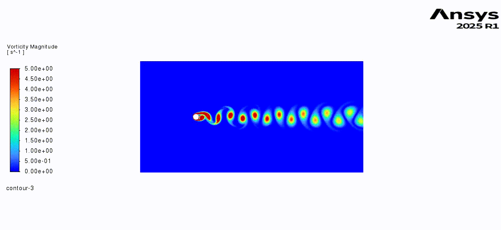

# Flow Over Circular Cylinder (ANSYS Fluent)

## Objective
To simulate unsteady external flow over a circular cylinder using ANSYS Fluent
and analyze vortex shedding behavior at moderate Reynolds numbers.

## Simulation Details
- Solver: ANSYS Fluent (pressure-based)
- Flow model: Laminar, transient
- Reynolds number: Re = 250
- Mesh: Body-fitted mesh around the cylinder

## Results

### Velocity Contours

### Pressure Contours

### Vorticity Contours

### Force Coefficients

#### Lift Coefficient vs Time

#### Drag Coefficient vs Time

The lift coefficient exhibits periodic oscillations due to von Kármán
vortex shedding. The drag coefficient oscillates around a mean value of
approximately **Cd ≈ 1.4**.

### Vorticity Shedding Animation

## Observations
- Periodic vortex shedding captured at Re = 250
- Alternating vortices form in the wake region
- Results are consistent with classical cylinder flow behavior

## Notes
This study focuses on demonstrating unsteady external flow simulation
workflow in ANSYS Fluent.
