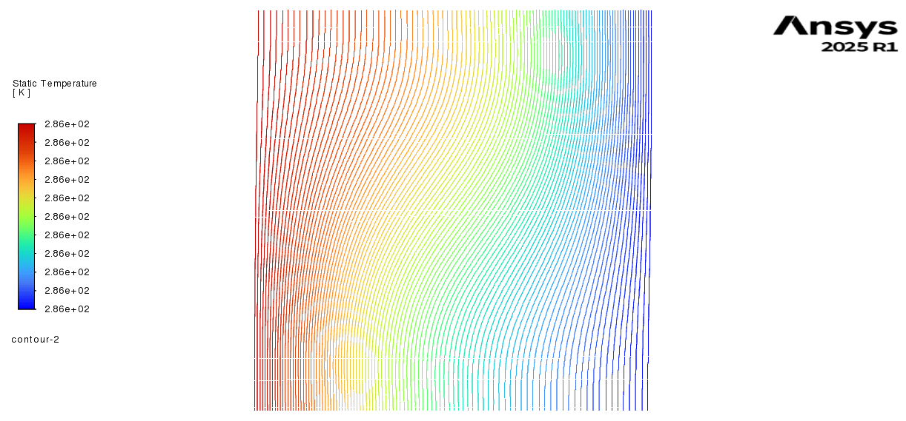
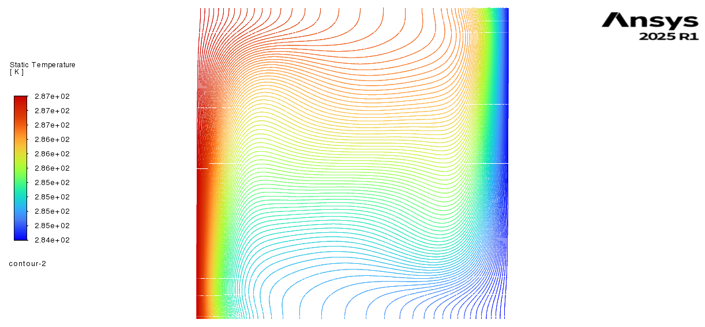
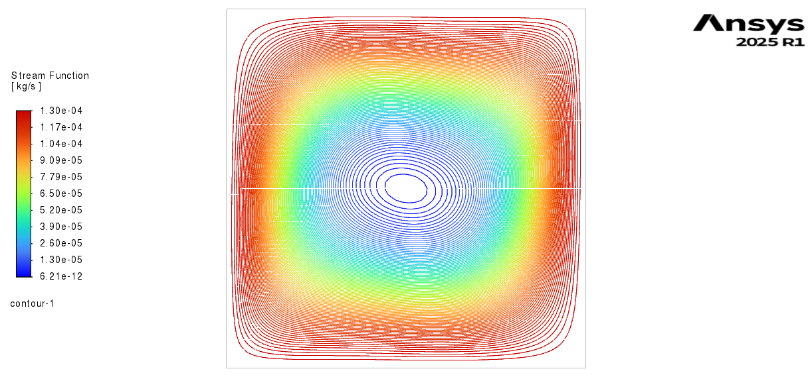
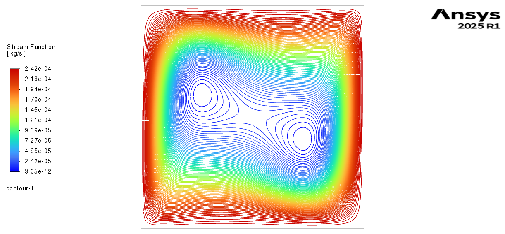
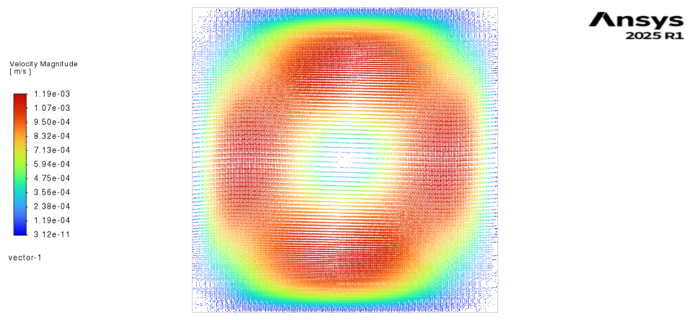
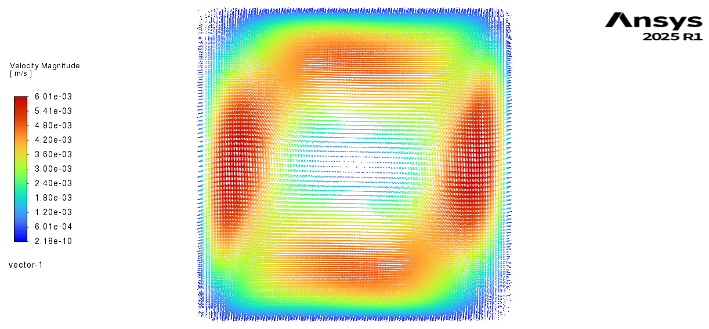

# Natural Convection in a Square Cavity (ANSYS Fluent)

## Objective
To simulate buoyancy-driven natural convection in a square cavity using
ANSYS Fluent and validate heat transfer predictions against the classical
benchmark results reported by **Vahl Davis (1983)**.

---

## Problem Description
A two-dimensional square cavity with differentially heated vertical walls
is considered.

**Boundary conditions:**
- Left wall: Hot wall (constant temperature)
- Right wall: Cold wall (constant temperature)
- Top and bottom walls: Adiabatic
- All walls: No-slip condition

The flow is driven purely by buoyancy forces.

---

## Simulation Details
- Solver: ANSYS Fluent (pressure-based)
- Flow regime: Laminar natural convection
- Energy equation: Enabled
- Buoyancy model: Boussinesq approximation
- Spatial discretization: Second-order schemes
- Rayleigh numbers studied (low → high):
  - Ra = 1×10³
  - Ra = 1×10⁴
  - Ra = 1×10⁵
  - Ra = 1×10⁶

---

## Results (Low → High Rayleigh Number)

### Ra = 1×10³
- Heat transfer is primarily conduction-dominated
- Isotherms are nearly vertical
- Flow circulation is weak

### Ra = 1×10⁴
- Onset of convection effects
- Mild distortion of isotherms
- Single primary circulation cell becomes stronger

### Ra = 1×10⁵
- Convection-dominated heat transfer
- Thin thermal boundary layers form near vertical walls
- Stronger circulation inside the cavity

### Ra = 1×10⁶
- Highly convection-dominated regime
- Very thin thermal boundary layers
- Intense circulation driven by buoyancy forces

---

## Isotherms (Temperature Contours)

**Ra = 1×10³**  

**Ra = 1×10⁴**  

**Ra = 1×10⁵**  

**Ra = 1×10⁶**  

---

## Streamlines

**Ra = 1×10³**  

**Ra = 1×10⁴**  

**Ra = 1×10⁵**  

**Ra = 1×10⁶**  

---

## Velocity Vectors

**Ra = 1×10³**  

**Ra = 1×10⁴**  

**Ra = 1×10⁵**  

**Ra = 1×10⁶**  

## Heat Transfer Analysis

### Local Nusselt Number
Local Nusselt number distributions along the hot wall show:
- Higher values near the bottom and top corners
- Boundary-layer-controlled heat transfer
- Increasing heat transfer with Rayleigh number

The observed trends are consistent with classical natural convection behavior.

---

## Validation with Vahl Davis Benchmark

Validation is performed using the **average Nusselt number at the hot wall**,
which is the standard benchmark quantity for this problem.

### Average Nusselt Number Comparison (Low → High Ra)

| Rayleigh Number | Nu (Vahl Davis) | Nu (ANSYS CFD) | Error (%) |
|-----------------|----------------|---------------|-----------|
| 1×10³ | 1.118 | 1.147 | 2.5 |
| 1×10⁴ | 2.243 | 2.360 | 5 |
| 1×10⁵ | 4.519 | 4.754 | 5 |
| 1×10⁶ | 8.799 | 8.981 | 2 |

Error is computed as:

Error (%) = |Nu_CFD − Nu_VahlDavis| / Nu_VahlDavis × 100

Good agreement is observed across all Rayleigh numbers, confirming the
accuracy of the numerical solution.

## Conclusion
Natural convection in a square cavity was successfully simulated using
ANSYS Fluent for Rayleigh numbers ranging from **10³ to 10⁶**. The predicted
flow and thermal fields exhibit physically consistent behavior, and
validation using average Nusselt numbers shows good agreement with the
Vahl Davis benchmark.

This benchmark case demonstrates accurate simulation of buoyancy-driven
heat transfer and establishes confidence in the numerical methodology.

---

## Reference
Vahl Davis, G.  
*Natural Convection of Air in a Square Cavity: A Benchmark Numerical Solution*  
International Journal for Numerical Methods in Fluids, 1983.

