# Large Eddy Simulation (LES) of Flow over Urban Canopies (PadeOps)

## Objective
To simulate turbulent flow through a 1×1 urban canopy (single building-array)
configuration using Large Eddy Simulation (LES) and characterize wake
interactions, recirculation, and flow development within the building array.
Results are validated against published wind-tunnel data. This work forms
part of the M.Tech thesis research at IIT Hyderabad.

---

## Case Description
- Solver: PadeOps (pseudo-spectral LES solver)
- Configuration: 1×1 building-array (single building) immersed in a
  turbulent boundary layer
- Inflow generation: precursor simulation method, validated independently
  against the logarithmic law of the wall (see Precursor Validation below)
- Two precursor cases (Case1, Case2) were run to test grid independence
- Subgrid-scale model: Anisotropic Minimum Dissipation (AMD)
- Domain size: 0.27 x 0.18 x 0.18
- Grid resolution: 288 x 192 x 160

---

## Governing Equations

Filtered, incompressible Navier–Stokes equations solved in LES form:

$$
\frac{\partial \bar{u}_i}{\partial x_i} = 0
$$

$$
\frac{\partial \bar{u}_i}{\partial t} + \frac{\partial (\bar{u}_i \bar{u}_j)}{\partial x_j} = -\frac{1}{\rho}\frac{\partial \bar{p}}{\partial x_i} + \nu \frac{\partial^2 \bar{u}_i}{\partial x_j \partial x_j} - \frac{\partial \tau_{ij}}{\partial x_j}
$$

where $\tau_{ij}$ is the subgrid-scale stress tensor, closed using the
Anisotropic Minimum Dissipation (AMD) model.

---

## Precursor Simulation Validation

Before introducing the building, the inflow-generating precursor simulation
was validated against the logarithmic law of the wall to confirm a
physically realistic turbulent boundary layer.

- **Streamwise velocity** (U/u*) closely follows the log-law profile for
  both Case1 and Case2 across the boundary layer depth.
- **Turbulence intensity (TI)** tracks the log-law prediction well, with
  minor deviation in the outer layer.
- **Total shear stress** (⟨u'w'⟩/u*²) shows the expected linear decay from
  the wall to the boundary layer edge, confirming the simulation has reached
  a statistically stationary, equilibrium turbulent state before the
  building is introduced.

---

## Results

### Wake and Recirculation
Wake interactions and recirculation zones behind the building were
characterized through instantaneous and time-averaged velocity fields.

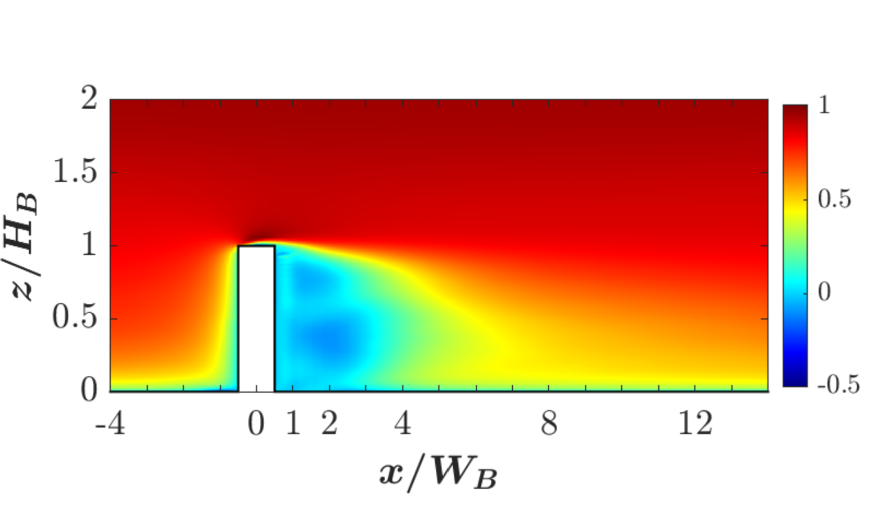
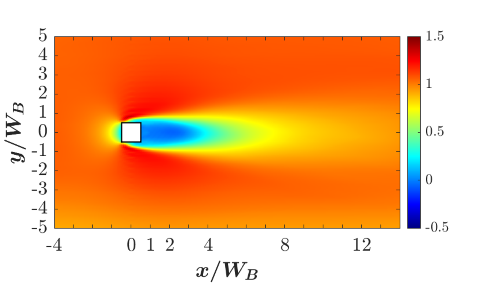

### Reynolds Stress Statistics

Normal Reynolds stress components (u'u', v'v', w'w') were computed and
visualized in both the vertical (x/W_B, z/H_B) and lateral (x/W_B, y/W_B)
planes, along with the Reynolds shear stress (⟨u'w'⟩) in the vertical plane.

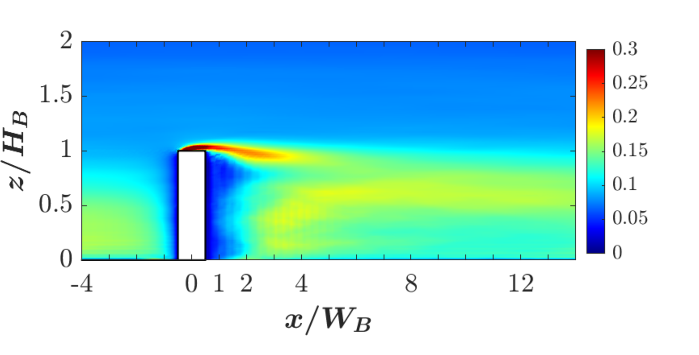
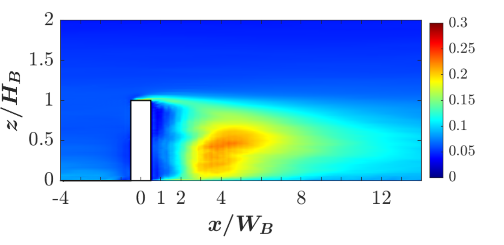
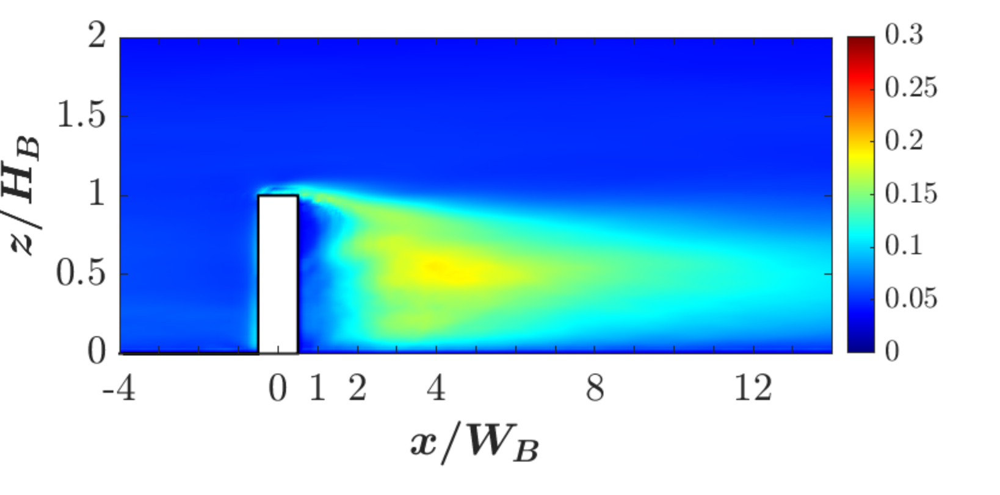

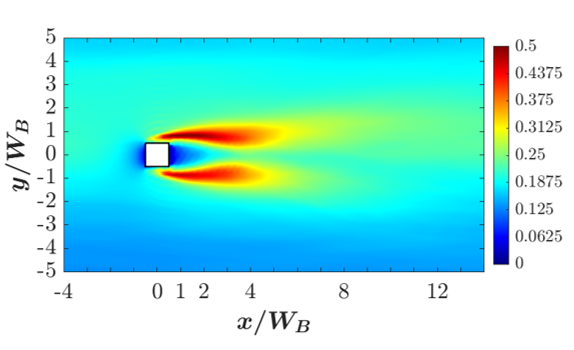
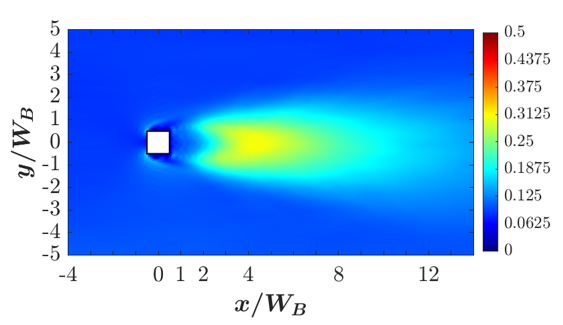
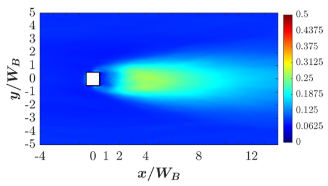

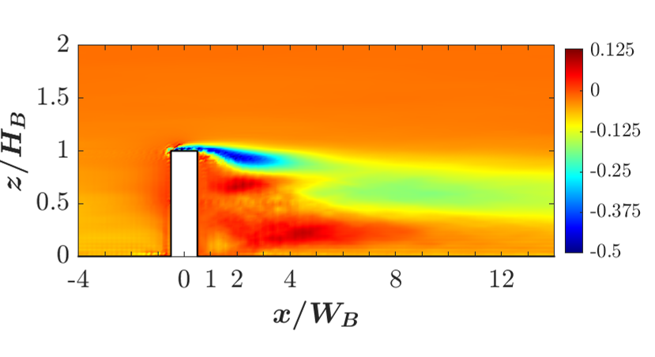

**Observations:**
- **u'u' (streamwise fluctuations):** Peak values occur in the shear layer
  at roof height (z/H_B ≈ 1) immediately behind the building, and in twin
  lobes flanking the wake edges (y/W_B ≈ ±1) in the lateral plane —
  consistent with shear-layer turbulence production at the separated edges
  of the building.
- **v'v' / w'w' (lateral/vertical fluctuations):** Peak turbulence shifts
  downstream and toward the wake centerline (x/W_B ≈ 4–6, y/W_B ≈ 0),
  below roof height (z/H_B ≈ 0.3–0.5) — consistent with turbulence
  generated in the shear layers advecting into and mixing within the
  building wake.
- **Reynolds shear stress (⟨u'w'⟩):** Shows a clear sign change across the
  shear layer — strongly negative just above and behind the building
  (momentum extraction from the mean flow into turbulence), transitioning
  to positive within the lower wake/recirculation region — the classic
  signature of turbulent momentum flux around a bluff body immersed in a
  boundary layer.

---

## Validation

Streamwise velocity profiles were compared against the wind-tunnel dataset
of **Mishra et al. (2023)** for the single-building (1×1) case, at multiple
downstream stations in both the lateral ($x/W_B$, $y/W_B$) and vertical
($x/W_B$, $z/H_B$) planes.

**Reference:**
Mishra, A., Placidi, M., Carpentieri, M., Robins, A. (2023).
*Wake Characterization of Building Clusters Immersed in Deep Boundary Layers.*
Boundary-Layer Meteorology, 189, 163–187.
https://doi.org/10.1007/s10546-023-00830-0

### Comparison Plots

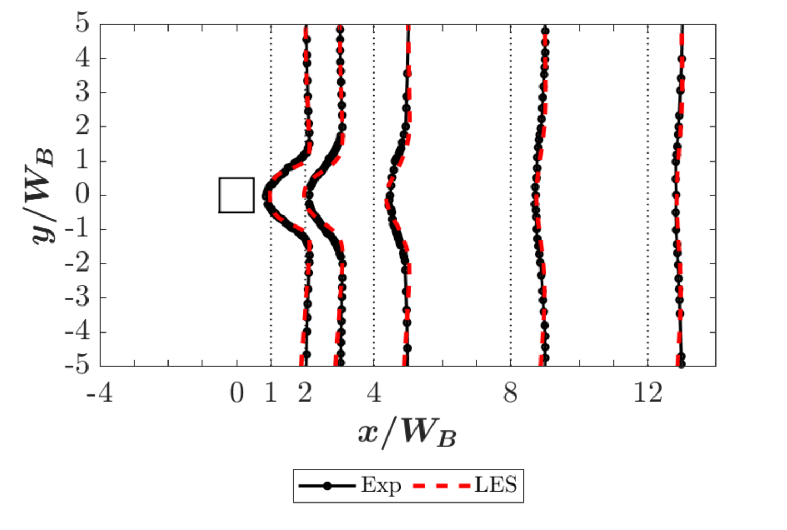
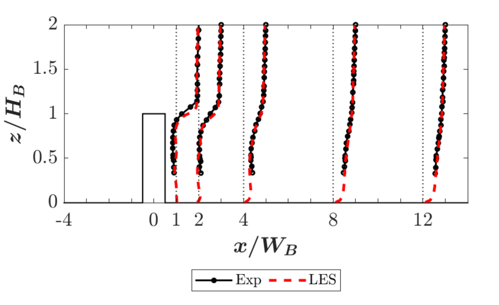

### Observations
- Excellent agreement between LES and experimental data across nearly all
  downstream stations (x/W_B = 1 through 13), in both lateral and vertical
  profiles.
- The closest agreement is observed farther downstream (x/W_B ≥ 3); modest
  deviation is visible in the immediate near-wake (x/W_B = 1), particularly
  in the vertical profile near the building height.
- The precursor-validated inflow (log-law consistent mean velocity,
  turbulence intensity, and shear stress) is a likely contributor to the
  strong overall agreement, in contrast to simpler inlet conditions used
  in other (RANS) studies.

---

## Key Learnings
- Precursor-simulation methodology for generating a physically realistic,
  log-law-consistent turbulent boundary layer inflow for LES.
- Application of LES to bluff-body/urban-canopy flow using a pseudo-spectral
  solver (PadeOps).
- Computation and physical interpretation of the full Reynolds stress
  tensor (normal and shear components) to characterize turbulence
  production and transport around a bluff body.
- Validation methodology against published wind-tunnel benchmark data across
  multiple downstream stations and measurement planes.

---

## Tools Used
- PadeOps
- MATLAB

---

## Status
✔ Precursor simulation validated against log law (velocity, TI, shear stress)
✔ 1×1 configuration simulated using LES
✔ Reynolds stress tensor (normal + shear components) computed and analyzed
✔ Validated against Mishra et al. (2023) at multiple downstream stations
  (lateral and vertical profiles)
◻ Extension to additional building-array configurations (ongoing, M.Tech thesis)
