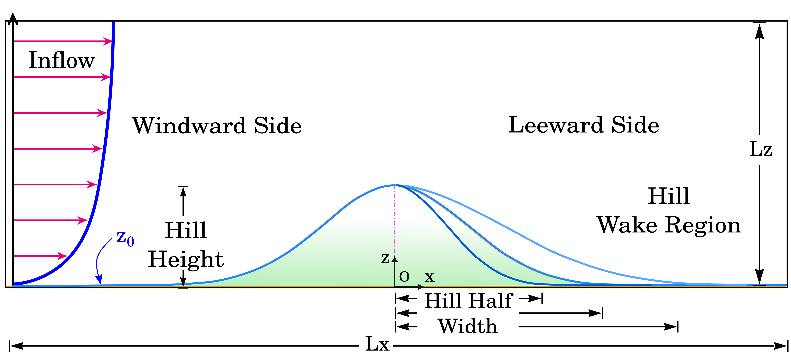
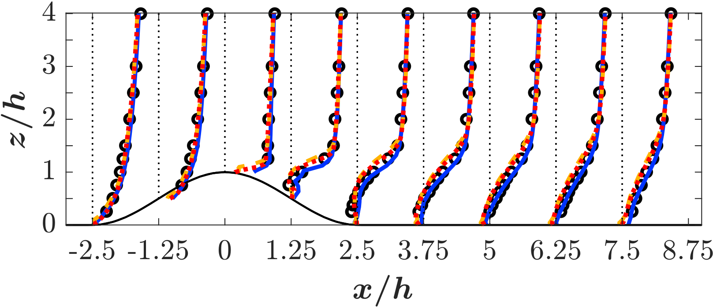
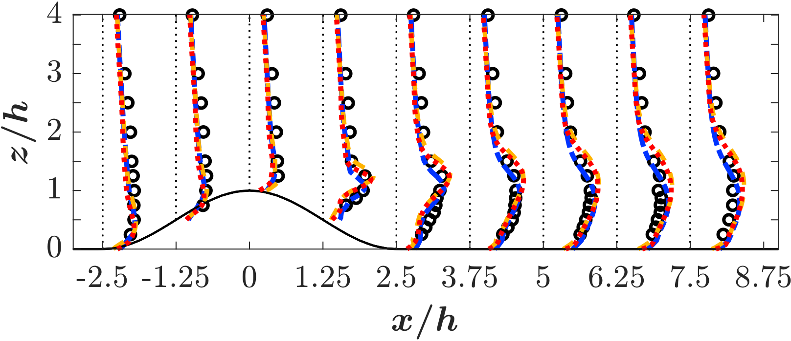
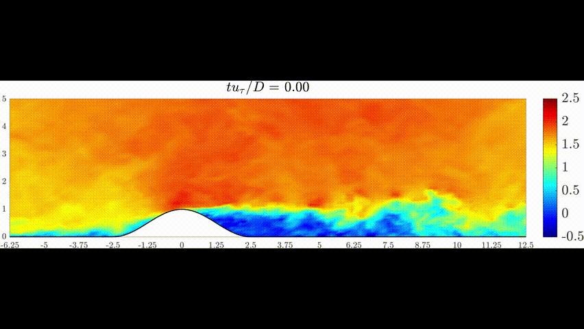

# LES of Flow Over Smooth Asymmetric Hills

## Objective

To investigate turbulent flow over a smooth asymmetric hill using Large Eddy Simulation (LES) and validate the predicted velocity and turbulence statistics against benchmark data.

---

## Simulation Details

- Solver: PadeOps
- Turbulence Model: Large Eddy Simulation (LES)
- Flow Type: Incompressible turbulent flow
- Geometry: Smooth asymmetric hill with varying leeward slopes
- Domain: Two-dimensional

---

## Problem Schematic

---

## Mean Velocity Contours

The contours show flow acceleration over the hill crest and wake development downstream of the hill.

---

## Validation of Mean Velocity Profiles

Mean velocity profiles are compared with benchmark data and show good agreement throughout the flow domain.

---

## Turbulence Intensity (TI) Contours

The turbulence intensity contours highlight the evolution of turbulent structures over the hill and within the wake region. Increased turbulence levels are observed downstream of the hill due to flow separation and shear layer development.

---

## Validation of Turbulence Profiles

Predicted turbulence statistics compare favorably with reference data, demonstrating the capability of LES to capture large-scale turbulent structures.

---

## Flow Animation

The animation illustrates the temporal evolution of the turbulent flow field over the hill.

---

## Key Findings

- Flow accelerates near the hill crest.
- Wake structures develop downstream of the hill.
- LES captures large-scale turbulent motions effectively.
- Mean velocity and turbulence statistics show good agreement with benchmark data.

---

## Conclusion

The study highlights a clear sensitivity of the velocity, and turbulence intensity to slope. The least–steep hill (largest half–width) maintains attached flow or, at most, a very small recirculation region that remains close to the leeward surface. As the slope increases, the recirculation region enlarges, turbulence intensity increases, and the wake width increases and persists farther downstream. While the gentle hill consistently shows reduced deceleration and a rapidly decaying wake, the two steeper cases produce comparably larger recirculation regions.
