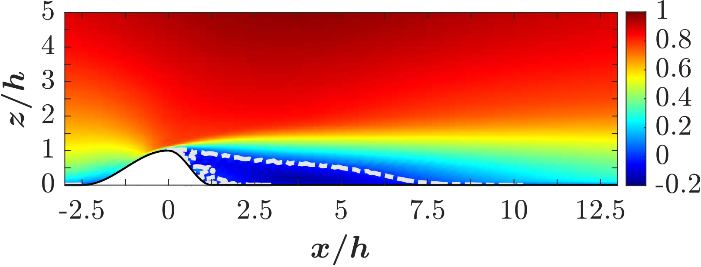
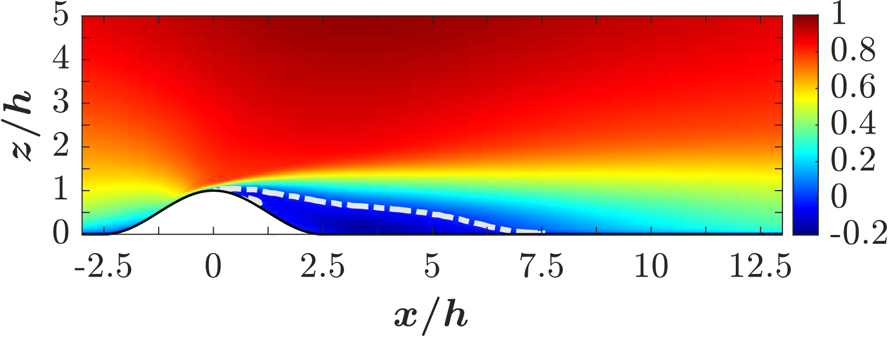
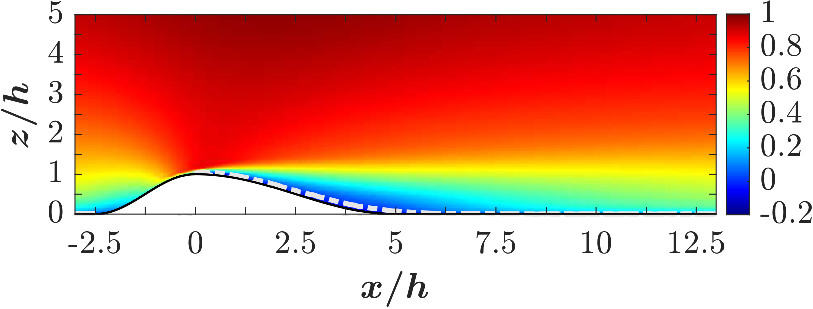
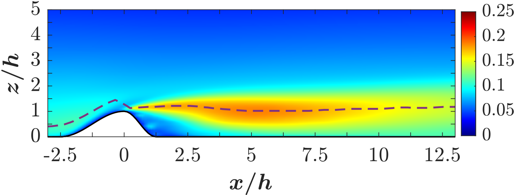
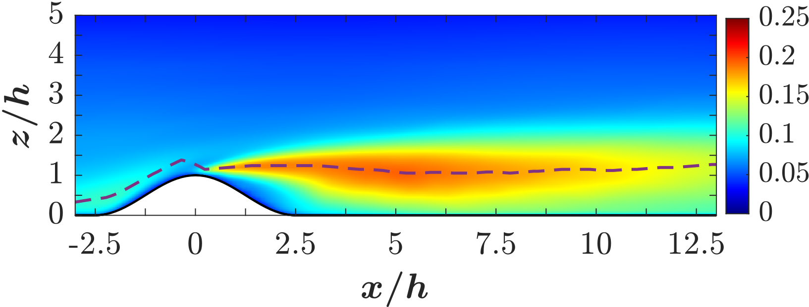
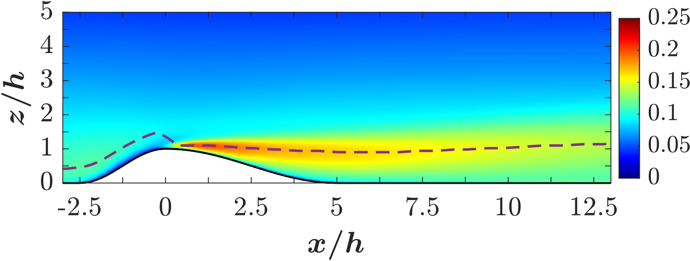
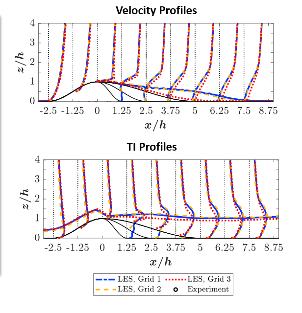

# LES of Flow Over Smooth Asymmetric Hills

## Objective
To perform Large Eddy Simulation (LES) of turbulent flow over smooth
asymmetric hills and validate the mean flow and turbulence statistics
against published benchmark data.

## Simulation Details
- Solver: PadeOPS
- Turbulence modeling: Large Eddy Simulation (LES)
- Subgrid-scale model: Anisotropic subgrid scale model
- Flow type: Incompressible turbulent flow

## Results

### Mean Velocity Field

### Reynolds Stress / Turbulence Statistics

## Validation
Mean velocity profiles and turbulence statistics are compared with
benchmark data reported in literature. Good agreement is observed,
confirming the accuracy of the LES setup.

## Notes
This project demonstrates research-level LES capability and validation
of turbulent flow over complex terrain using PaDEOPS.
