# Numerical Study of Fin Number in a Heat Sink using ANSYS Icepak

## Objective

To investigate the effect of fin number on the thermal and fluid-flow
performance of a heat sink using ANSYS Icepak.

Four heat sink configurations with 5, 10, 15, and 20 fins were simulated
while maintaining a constant fin thickness of 0.025 cm (0.25 mm).

---

## Simulation Details

- Software: ANSYS Icepak
- Flow: Laminar
- Working fluid: Air
- Fin type: Rectangular fins
- Fin thickness: 0.025 cm (0.25 mm)
- Number of fins: 5, 10, 15, 20
- Simulation: Steady-state
- Heat transfer: Conjugate heat transfer

---

## Geometry

The heat sink geometry was varied by changing the number of fins while
keeping the fin thickness constant.

---

## Results

### N = 5 Fins

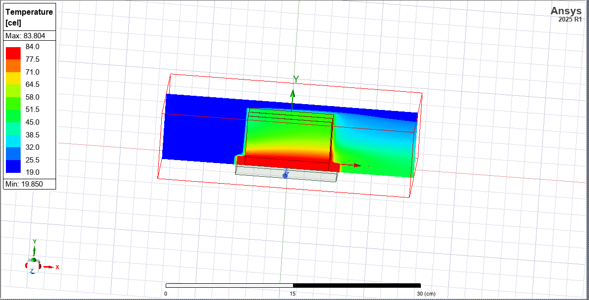

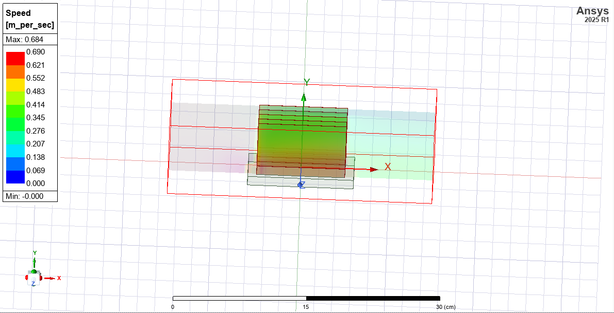

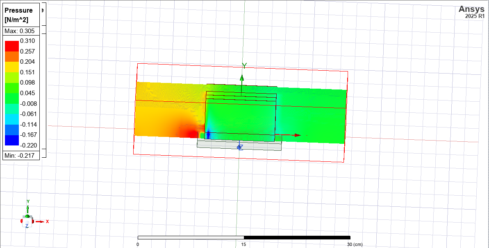

---

### N = 10 Fins

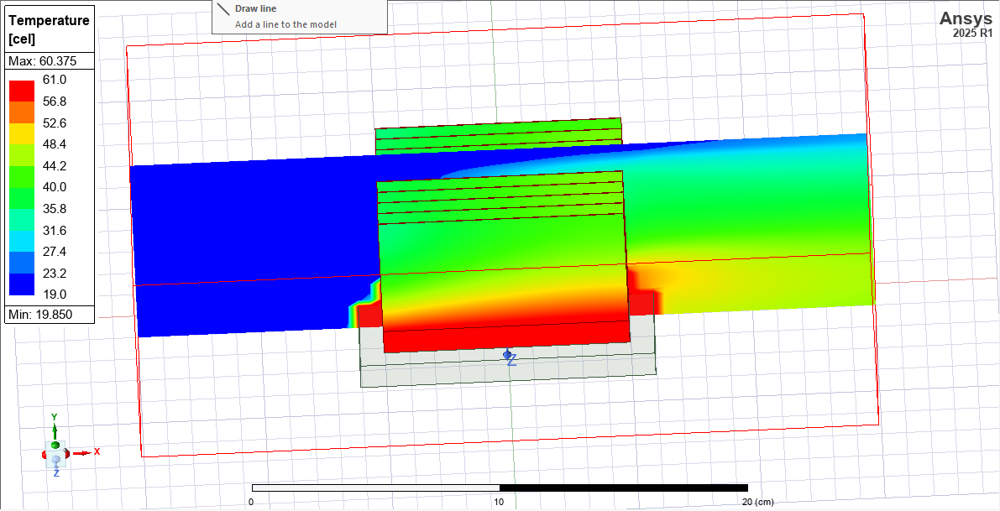

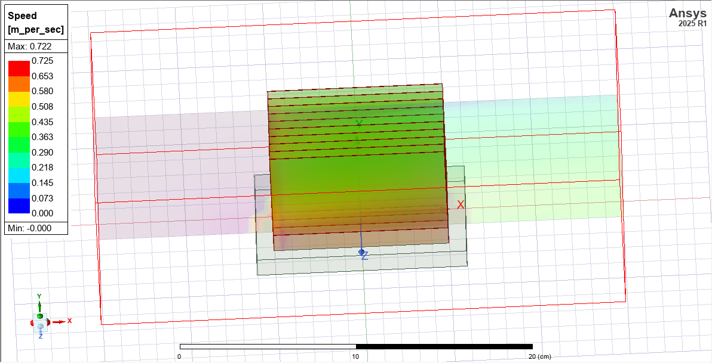

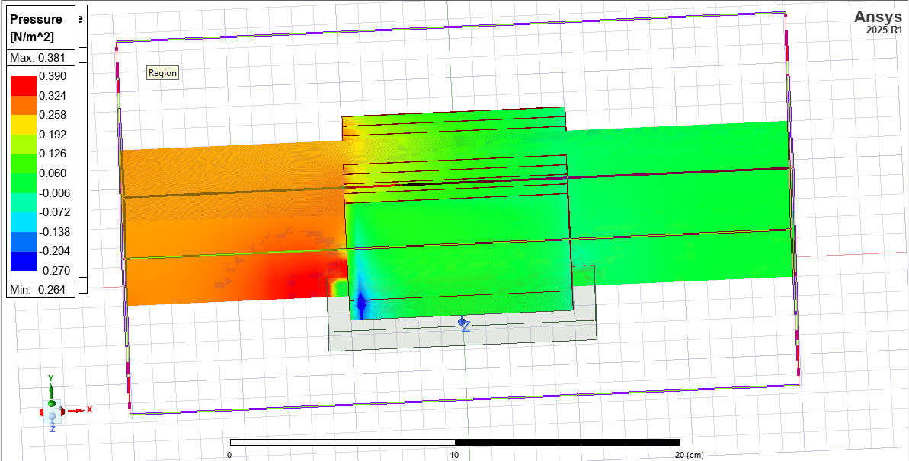

---

### N = 15 Fins

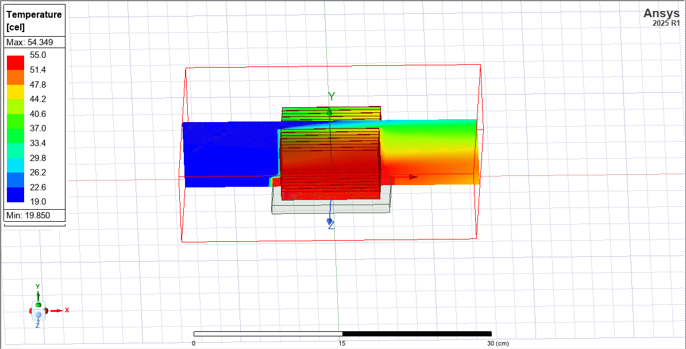

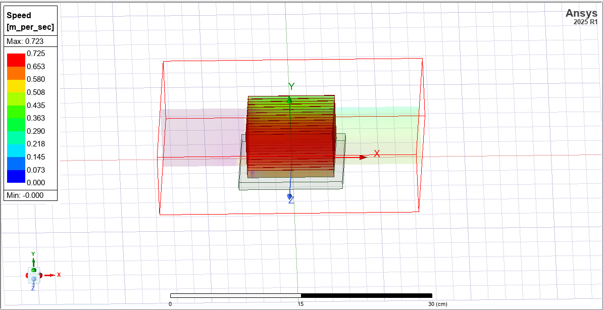

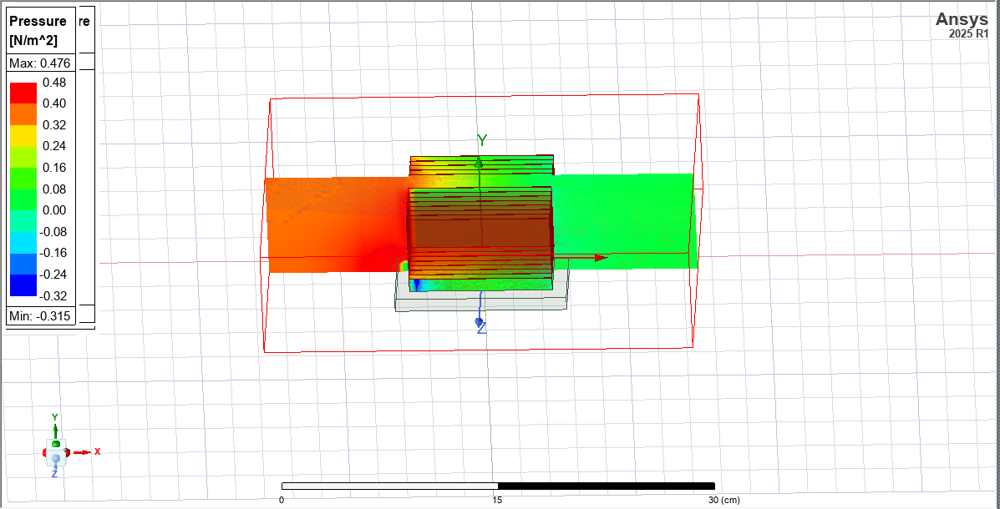

---

### N = 20 Fins

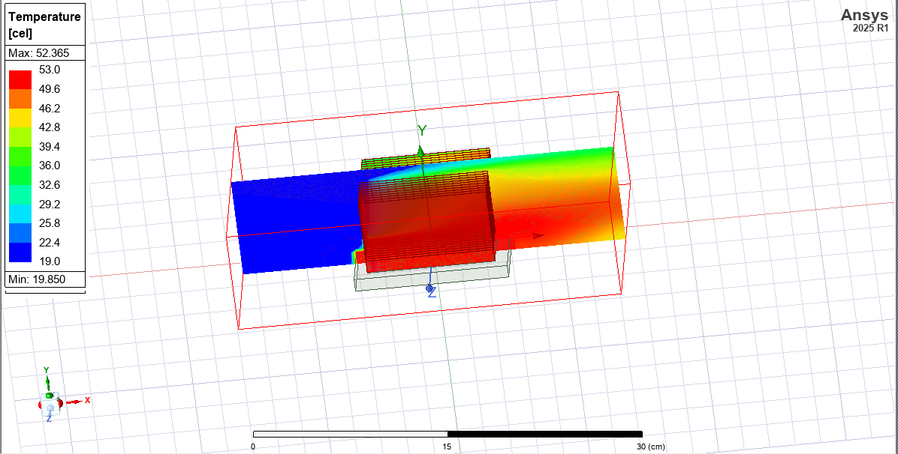

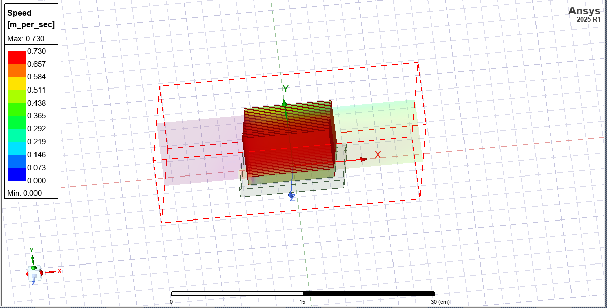

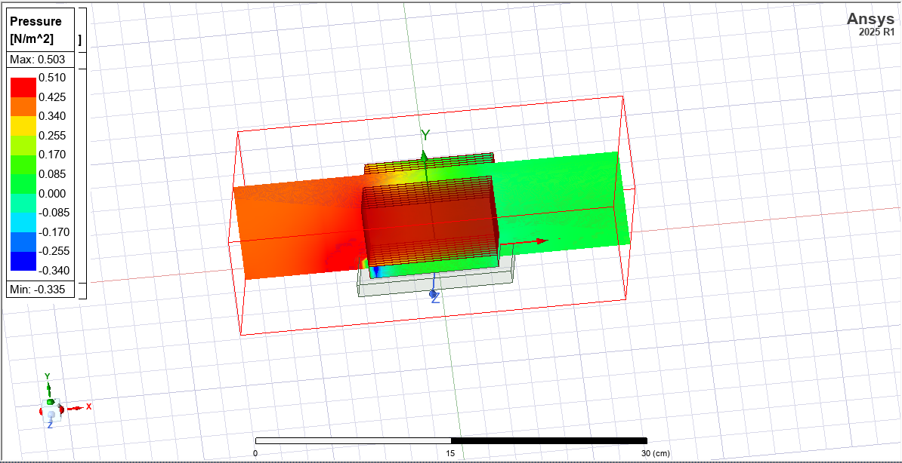

---

## Parametric Comparison

| Number of Fins | Paper (°C) | Present Work (°C) | Error (%) |
|---:|---:|---:|---:|
| 5  | 89.6266 | 83.804 | −6.50 |
| 10 | 62.9506 | 60.300 | −4.21 |
| 15 | 58.8103 | 54.349 | −7.59 |
| 20 | 61.9335 | 52.365 | −15.45 |

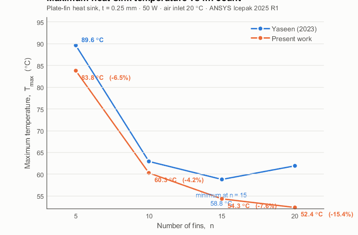

---

## Key Findings

- The maximum temperature decreases significantly as the number of fins increases from 5 to 15.
- The present ANSYS Icepak results predict a further reduction in maximum temperature at 20 fins, unlike the reference study, which reported the minimum temperature at 15 fins.
- The predicted maximum temperatures in the present study are lower than the values reported by Yaseen (2023) for all four configurations.
- The deviation between the present results and the reference study ranges from 4.21% to 15.45%.
- The closest agreement with the reference study is obtained for the 10-fin configuration, with a deviation of 4.21%.
- The 20-fin configuration gives the lowest maximum temperature in the present study, at 52.365 °C.

---

## Conclusion

A numerical investigation of the effect of fin number on heat sink thermal performance was carried out using ANSYS Icepak. Simulations were performed for 5, 10, 15, and 20 fins while maintaining a constant fin thickness of 0.25 mm.

The present results show a continuous reduction in maximum temperature with increasing fin number, with the lowest temperature of 52.365 °C obtained for 20 fins. The results show reasonable agreement with the reference study for the 5–15 fin configurations, while a different trend is observed for 20 fins.

The comparison demonstrates the influence of fin number on heat sink thermal performance and highlights the sensitivity of the numerical results to the modeled configuration and simulation conditions.

---

## Reference

S. J. Yaseen,

"Numerical study of the fluid flow and heat transfer in a finned heat sink
using Ansys Icepak,"

Open Engineering, 2023.

DOI: 10.1515/eng-2022-0440
